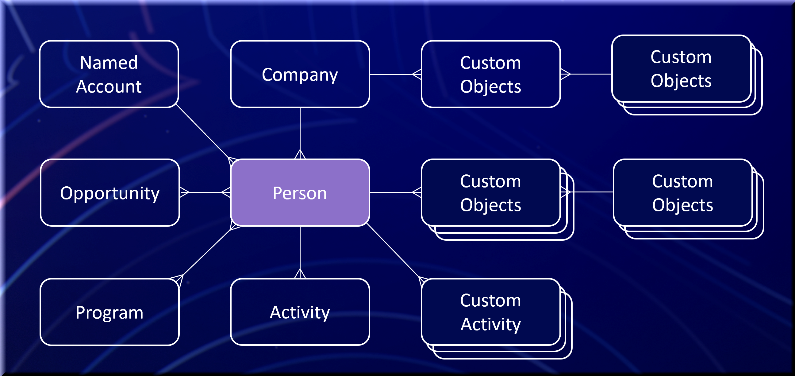

# Aan de slag

Marketo Engage is een platform voor marketingautomatisering dat marketers in staat stelt gepersonaliseerde meerkanaalprogramma&#39;s en -campagnes te beheren voor vooruitzichten en klanten. Het platform van de Marketo Engage kan worden uitgebreid gebruikend integratiepunten. Hieronder vind je de kernentiteiten en hun relaties.

>[!NOTE]
>De SOAP API wordt afgekeurd en zal na 31 oktober 2025 niet meer beschikbaar zijn. Al nieuwe ontwikkeling zou met Marketo [ REST API ](./rest-api/rest-api.md) moeten worden gedaan, en de bestaande diensten zouden tegen die datum moeten worden gemigreerd om onderbrekingen in de dienst te vermijden. Als u de dienst hebt die SOAP API gebruikt, te raadplegen gelieve de SOAP API [ Gids van de Migratie ](./soap-api/migration.md) voor informatie over hoe te migreren.
>

Wanneer of de Inheemse verbinding van SFDC of van de Dynamica CRM van MS op een instantie van het Marketo Engage wordt toegelaten, zijn de volgende voorwerpen read-Only: Bedrijf, Opportunity, de Rol van de Kanaal, Persoon van de Verkoop

## Persoon (leads)

Mensen vormen de basis van elk platform voor marketingautomatisering. In Marketo worden alle niet-verkooppersoonrecords vanuit verkoopperspectief als leads aangeduid, ongeacht of ze zijn aangewezen als leads, vooruitzichten, verdachten, contactpersonen, enzovoort. Het hoofdobject wordt geleverd met een set standaardvelden, zoals e-mail, voornaam en achternaam. U kunt extra velden toevoegen aan het type hoofdobject om de typen informatie die aan records in het systeem zijn gekoppeld, uit te breiden. Aangepaste kenmerken kunnen worden gelezen en geschreven als standaardvelden. Een volledige lijst met velden vindt u in het menu Marketo **[!UICONTROL Admin]** > **[!UICONTROL Field Management]** . Leads worden in Marketo op unieke wijze geïdentificeerd door het id-veld. Andere unieke toetsen moeten extern van het systeem worden afgedwongen.

Verwante APIs: [ REST ](https://developer.adobe.com/marketo-apis/api/mapi/#tag/Leads), [ JavaScript ](javascript-api/lead-tracking.md#lead-tracking-api)

## Activiteiten

Leads onderhouden op een paar manieren met uw organisatie. Een lead kan een pagina op de website van uw bedrijf bezoeken, een exporteerprogramma bijwonen of een whitepaper downloaden. Elk van deze acties kan binnen Marketo worden gevangen om een marktleider te helpen beter begrijpen welke activiteiten een lood deed en wanneer zodat kunnen zij geschikte en relevante mededelingen coördineren. Activiteiten zijn altijd gerelateerd aan leads door leadId.

U kunt uw eigen aangepaste activiteiten definiëren. Nadat u een aangepaste activiteit hebt gemaakt en gepubliceerd, kunt u aangepaste activiteiten toevoegen via de Marketo API. Meer informatie over douaneactiviteiten kan [ hier ](https://experienceleague.adobe.com/en/docs/marketo/using/product-docs/administration/marketo-custom-activities/understanding-custom-activities) worden gevonden.

Verwante APIs: [ REST ](https://developer.adobe.com/marketo-apis/api/mapi/#tag/Activities), [ JavaScript ](javascript-api/lead-tracking.md#munchkin-behavior)

## Programma&#39;s en campagnes

Een programma is het mechanisme waarmee een marktleider al zijn verschillende soorten marketinginspanningen van één centrale locatie organiseert. Een voorbeeld van een programma is een e-mailexplosie. Een lead kan meerdere acties/activiteiten in verband met een bepaald programma uitvoeren die bij het programma horen. Dit wordt doorbloeding genoemd. Een voorbeeldprogressie van een e-mailbladerprogramma zou registreren wanneer een lood een e-mail wordt verzonden, wanneer de persoon e-mail opende of zij door een verbinding in e-mail klikten.

Campagnes worden gecreeerd om een specifiek doel en een specifiek doel binnen een Programma te dienen. Een voorbeeld van een campagne zou kunnen zijn om een groep van lood te versmallen en hen de e-mailontploffing te verzenden, of een verkoopvertegenwoordiger voor follow-up op de hoogte te brengen als een lood door een verbinding binnen het e-mailblastageprogramma klikt.

Verwante APIs: [ REST ](https://developer.adobe.com/marketo-apis/api/mapi/#tag/Campaigns)

## Tags

Met tags kunt u gegevens groeperen voor rapportagedoeleinden. Deze herkenningstekens verstrekken de capaciteit om gegevens te categoriseren en te bepalen hoe u over uw Programma wilt rapporteren om de doeltreffendheid van het Programma en ROI te begrijpen.

Als Marketo-beheerder kunt u vereiste en optionele labeltypen maken die beschikbaar zijn voor selectie wanneer een Marketo-gebruiker een programma maakt. Mogelijke waarden voor elk van deze typen tags worden door u gedefinieerd en geven aan hoe uw bedrijf aangepaste tags wil gebruiken voor rapportagedoeleinden.

U kunt bijvoorbeeld een aangepast type ‘Regio’ maken met meerdere tagwaarden (bijvoorbeeld Noordoost, Zuidoost), zodat u kunt analyseren welk gebied de meeste leads genereert. Of u kunt bijvoorbeeld een type code &#39;Eigenaar&#39; maken, waarmee u kunt beoordelen en begrijpen welke programmaeigenaars (bijvoorbeeld Maria, David of John) het meeste effect hebben op het creëren van kansen en kansen. Meer informatie over markeringen kan [ hier ](https://experienceleague.adobe.com/en/docs/marketo/using/product-docs/core-marketo-concepts/programs/working-with-programs/understanding-tags) worden gevonden.

Verwante APIs: [ REST ](https://developer.adobe.com/marketo-apis/api/asset/)

## Lijsten

Met lijsten kan een markering een verzameling leads ordenen. Er zijn twee typen lijsten in Marketo: statisch en slim. Een statische lijst is een vaste lijst met leads die een markator naar keuze kan toevoegen of verwijderen. Een slimme lijst is een dynamische verzameling van leads op basis van een reeks aangewezen kenmerken. Een voorbeeld van een slimme lijst zou zijn &quot;Alle leads die de prijspagina op onze website hebben bezocht.&quot; Deze slimme lijst blijft groeien naarmate meer leads de prijspagina bezoeken. Meer informatie over lijsten kan [ hier ](https://experienceleague.adobe.com/en/docs/marketo/using/home) worden gevonden.

Verwante APIs: [ REST ](https://developer.adobe.com/marketo-apis/api/asset/#tag/Static-Lists)

## Kansen

Marktdeelnemers leveren verkoopkansen. Een kans vertegenwoordigt een potentiële verkoopovereenkomst en wordt geassocieerd met een lood of een contact en een organisatie in Marketo. Een opportuniteitsrol is de doorsnede tussen een bepaalde leiding en een organisatie. De opportuniteitsrol heeft betrekking op de functie van een lead binnen de organisatie.

Verwante APIs: [ REST ](https://developer.adobe.com/marketo-apis/api/mapi/#tag/Opportunities)

## Bedrijven

Een organisatie, ook wel een account in Marketo genoemd, verwijst naar de organisatie waartoe een persoon behoort. Wanneer het gebruiken van ROI rapportering in Marketo of de Analyse van de Cyclus van de Opbrengst (RCA), is het belangrijk om mensen met hun organisatie en kansen te associëren zodat kan de juiste ROI attributie worden bepaald.

Verwante APIs: [ REST ](https://developer.adobe.com/marketo-apis/api/mapi/#tag/Companies)

## Assets

Assets verwijst naar bestemmingspagina&#39;s, e-mails, formulieren en afbeeldingen die in een programma worden gebruikt. Assets kan lokaal zijn voor een bepaald programma of wereldwijd. Globale middelen zijn beschikbaar in elk programma.

Verwante APIs: [ REST ](https://developer.adobe.com/marketo-apis/api/asset/)

## Tokens

Met tokens kan een markeerteken berichten personaliseren met elementen en logica toevoegen binnen stroomhandelingen. Er zijn tokens voor het algemene systeem, programma&#39;s, leads en bedrijven. Een voorbeeld van een lead-token is {{lead.First Name}} . Deze token kan in een e-mail worden geplaatst om de voornaam van de lead weer te geven.

Tokens die op het niveau van het Programma of van de omslag worden bepaald worden bedoeld als &quot;Mijn Tokens&quot;binnen Marketo. Mijn tokens kunnen van drie typen zijn: lokaal, overgeërfd of overschreven.

Mijn tokens die lokaal binnen een specifieke campagnemap of een specifiek programma worden gecreeerd zijn beschikbaar aan dat specifiek programma of (lokale) campagnemap. Mijn tokens die op het niveau van de campagnemap worden gecreeerd zijn beschikbaar voor gebruik over alle programma&#39;s binnen die (geërfte) campagnemap. Mijn tokens die op programmaniveau met douanewaarden worden gewijzigd veranderen niet de ouder Mijn Symbolische waarde van het teken op het niveau van de programmaomslag (met voeten getreden).

Mijn tokens gebruiken de naamgevingsconventie {{my.My Token}} , met het woord &quot;my&quot; toegevoegd aan het begin van de tokennaam. Als u bijvoorbeeld een Date-type Mijn token maakt met de naam EventDate, is de naam van het token {{my.EventDate}} . Meer informatie over Mijn Tokens kan [ hier ](https://experienceleague.adobe.com/en/docs/marketo/using/product-docs/core-marketo-concepts/programs/tokens/understanding-my-tokens-in-a-program) worden gevonden.

Verwante APIs: [ REST ](https://developer.adobe.com/marketo-apis/api/asset/#tag/Tokens)

## Aangepaste objecten

Met een aangepast Marketo-object kunt u een een-op-veel- of een veel-op-veel-relatie (Edge-Bridge-Edge) tot stand brengen tussen uw Marketo-leads en de aangepaste objectrapporten. Nadat u een aangepast Marketo-object hebt gemaakt en gepubliceerd, kunt u CRUD-bewerkingen op het aangepaste object uitvoeren via de Marketo API. Meer informatie over de verwezenlijking van douaneobjecten kan [ hier ](https://experienceleague.adobe.com/en/docs/marketo/using/home) worden gevonden. Wanneer nieuwe records aan het aangepaste object worden toegevoegd, kunt u een trigger voor een slimme lijst gebruiken om te reageren. U kunt douaneobjecten gegevens als filter in slimme lijsten (segmentatie), of in e-mail ook gebruiken gebruikend [ E-mail Scripting ](email-scripting.md).

Verwante APIs: [ REST ](https://developer.adobe.com/marketo-apis/api/mapi/#tag/Custom-Objects)

## Verkopers

Verkooppersoonrecords en leadrelaties kunnen in Marketo worden beheerd als native CRM-integratie niet is ingeschakeld. Deze verslagen bevatten basisinformatie over de Persoon van de Verkoop, zoals Naam, E-mail, en de Titel van de Baan, die voor het filtreren en penningen in Marketo kan worden gebruikt wanneer een lood door wordt bezeten. De verhouding aan een verkooppersoon wordt beheerd op het hoofdniveau door het &quot;externalSalesPersonId&quot;gebied, dat door [ leads van de Synchronisatie ](https://developer.adobe.com/marketo-apis/api/mapi/#tag/Leads/operation/syncLeadUsingPOST) API moet worden bijgewerkt.

Verwante APIs: [ REST ](https://developer.adobe.com/marketo-apis/api/mapi/#tag/Sales-Persons)
