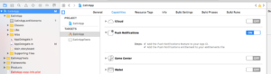

# Ionic

In dit onderwerp wordt beschreven hoe u de insteekmodule Marketo Cordova integreert. [!DNL Ionic] -condensator wordt momenteel niet ondersteund.

## Vereisten

1. [ voeg een toepassing in Marketo Admin ](https://experienceleague.adobe.com/en/docs/marketo/using/product-docs/mobile-marketing/admin/add-a-mobile-app) toe (verkrijg uw toepassing Geheime Sleutel en identiteitskaart van Munchkin).
1. Push van de opstelling Meldingen ([ iOS ](push-notifications.md) | [ Android ](push-notifications.md)).
1. Installeer [[!DNL Ionic] ](https://ionicframework.com/getting-started/) &amp; [ Cordova CLI ](https://cordova.apache.org/docs/en/latest/guide/cli/).

## Installatie-instructies

### Marketo-insteekmodule instellen [!DNL Ionic]

1. Ervan uitgaande dat Cordova CLI is geïnstalleerd, gaat u naar de toepassingsmap van [!DNL Ionic] en voert u de volgende opdracht uit om de Marketo-insteekmodule aan uw toepassing toe te voegen:

   `$ ionic plugin add https://github.com/Marketo/PhoneGapPlugin.git --variable APPLICATION_SECRET_KEY="YOUR_APPLICATION_SECRET"`

1. Voer de volgende opdracht uit om te bevestigen dat de plug-in aan de toepassing is toegevoegd:

   `$ ionic plugin list com.marketo.plugin 0.X.0 "MarketoPlugin"`

### Migreren naar nieuwere versie (optioneel)

1. Voer de volgende opdracht uit om een bestaande plug-in te verwijderen:

   `$ ionic plugin remove com.marketo.plugin`

1. Voer de volgende opdracht uit om de plug-in te lezen:

   `$ ionic plugin add https://github.com/Marketo/PhoneGapPlugin.git --variable APPLICATION_SECRET_KEY="YOUR_APPLICATION_SECRET"`

### Enable Push Notifications in xCode

1. Schakel de functie voor pushmeldingen in in het xCode-project.

### Pushmeldingen bijhouden

Plak de volgende code in de functie `application:didFinishLaunchingWithOptions:` .

>[!BEGINTABS]

>[!TAB  Doelstelling C ]

```
Marketo *sharedInstance = [Marketo sharedInstance];

[sharedInstance trackPushNotification:launchOptions];
```

>[!TAB  Swift ]

```
let sharedInstance: Marketo = Marketo.sharedInstance()

sharedInstance.trackPushNotfication(launchOptions)
```

>[!ENDTABS]

### Marketo Framework initialiseren

Om ervoor te zorgen dat het Marketo-framework wordt gestart bij het opstarten van de app, voegt u de volgende code toe onder de functie `onDeviceReady` in het JavaScript-hoofdbestand.

U moet `ionicCordova` doorgeven als frameworktype voor [!DNL Ionic] Cordova-apps.

#### Syntaxis

```javascript
// This method will Initialize the Marketo Framework using Your MunchkinId and Secret Key
marketo.initialize(
  function() { console.log("MarketoSDK Init done."); },
  function(error) { console.log("an error occurred:" + error); },
  'YOUR_MUNCHKIN_ID',
  'YOUR_SECRET_KEY',
  'FRAMEWORK_TYPE'
);

// For session tracking, add following.
marketo.onStart(
  function(){ console.log("onStart."); },
  function(error){ console.log("Failed to report onStart." + error); }
);
```

#### Parameters

- Callback met succes: functie die moet worden uitgevoerd als het Marketo-framework correct is geïnitialiseerd.
- Callback van mislukking: functie uit te voeren als het Marketo-framework niet kan worden geïnitialiseerd.
- MUNCHKIN-id: Munchkin-id ontvangen van Marketo op het moment van registratie.
- SECRET KEY : Geheime sleutel die bij de registratie van Marketo is ontvangen.

### Marketo-pushmelding initialiseren

Om ervoor te zorgen dat de Marketo-pushmelding wordt gestart, voegt u de volgende code toe na de geïnitialiseerde functie in het JavaScript-hoofdbestand.

#### Syntaxis

```javascript
// This function will Enable user notifications (prompts the user to accept push notifications in iOS)
marketo.initializeMarketoPush(
    function() { console.log("Marketo push successfully initialized."); },
    function(error) { console.log("an error occurred:" + error); },
    'YOUR_GCM_PROJECT_ID' // This is required for Android and will be ignored in iOS
);
```

#### Parameters

- Callback met succes: functie die moet worden uitgevoerd als de Marketo-pushmelding correct is geïnitialiseerd.
- Callback van mislukking: functie uit te voeren als de pushmelding van Marketo niet kan worden geïnitialiseerd.
- GCM_PROJECT_ID: identiteitskaart van het Project GCM die in [ wordt gevonden de Console van Ontwikkelaars van Google ](https://accounts.google.com/ServiceLogin?service=cloudconsole&passive=1209600&osid=1&continue=https://console.cloud.google.com/apis/dashboard&followup=https://console.cloud.google.com/apis/dashboard) na het creëren van app.

Het token kan ook bij afmelden niet worden geregistreerd.

```javascript
marketo.uninitializeMarketoPush(
  function() { console.log("Marketo push successfully uninitialized."); } ,
  function(error) { console.log("an error occurred:" + error); }
);
```

## Associate Lead

U kunt een Marketo Lead maken door de associatedLead-functie aan te roepen.

### Syntaxis

```javascript
marketo.associateLead(
  function(){ console.log("MarketoSDK : Lead Added"); },
  function(error){ console.log("an error occurred:" + error); },
  'Lead_Data_JSON_String'
);
```

### Parameters

- Callback met succes: functie uit te voeren als het Marketo-framework de lead correct koppelt.
- Callback van mislukking: functie om uit te voeren als het kader van Marketo er niet in slaagt om het lood te associëren.
- Lead Data: lead data in JSON-tekenreeksindeling.

### Voorbeeld

```javascript
// First create a lead as shown below
var lead = {};
lead[marketo.KEY_FIRST_NAME] = "Ionic";
lead[marketo.KEY_LAST_NAME] = "App";
lead[marketo.KEY_EMAIL] = email;
lead[marketo.KEY_ADDRESS] = "demo address";
lead[marketo.KEY_CITY] = "city";
lead[marketo.KEY_STATE] = "state";
lead[marketo.KEY_COUNTRY] = "country";
lead[marketo.KEY_POSTAL_CODE] = "postalCode";
lead[marketo.KEY_GENDER] = "gender";

// Use associateLead function to associate it.
marketo.associateLead(
  function() { console.log("MarketoSDK : Lead Associated"); },
  function(error) { console.log("an error occurred:" + error); },
  JSON.stringify(lead)
);
```

## Handeling rapporteren

U kunt elke door de gebruiker uitgevoerde actie rapporteren door de functie `reportaction` aan te roepen.

### Syntaxis

```javascript
marketo.reportaction(
  function(){ console.log("MarketoSDK : New event sent "); },
  function(error){ console.log("an error occurred:" + error); },
  'Action_Name',
  'Action_Data_JSON_String'
);
```

### Parameters

- Callback met succes: functie die wordt uitgevoerd als Marketo-framework de handeling meldt.
- Callback van mislukking: functie uit te voeren als het kader van Marketo geen actie meldt.
- Naam van handeling: naam van handeling.
- Action Data: actiegegevens in JSON-tekenreeksindeling.

### Voorbeeld

```javascript
// First create an event as below
var event = {
    "Action Type":"Add To Cart",
    "Action Details":"Adding Product in cart",
    "Action Metric":"10",
    "Action Length":"1"
}

marketo.reportaction(
    function(){ console.log("Reported action successfully."); },
    function(error){ console.log("Failed to report action." + error); },
    "Add To Cart",
    JSON.stringify(event)
);
```

## Sessierapportage

Bind de gebeurtenistypen &quot;pause&quot; en &quot;resume&quot;, zoals hieronder wordt weergegeven, om gebeurtenissen Start en Stop te melden. Dit wordt gebruikt om de tijd te volgen die in uw mobiele toepassing wordt doorgebracht. Opmerking: dit is verplicht in Android.

```javascript
//Add the following code in your www/js/index.js

bindEvents: function() {
   document.addEventListener('pause', this.onStop, false);
   document.addEventListener('resume', this.onStart, false);
},
onStop: function() {
   marketo.onStop(
       function(){ console.log("onStop"); },
       function(error){ console.log("Failed to report onStop." + error); }
   );
},
onStart: function() {
   marketo.onStart(
       function(){ console.log("onStart."); },
       function(error){console.log( "Failed to report onStart." + error); }
   );
},
```

## Leads maken

Er zijn drie manieren om leads te maken van een hybride app:

1. Marketo MME SDK
1. MARKETO REST API
1. Formulier verzenden

Afhankelijk van de gebruikte methode wordt een nieuw gemaakte lead herkend door verschillende triggers en filters. Leads die zijn gemaakt met de MME SDK- of REST-API, worden weergegeven in de triggers en filters voor &#39;Lead gemaakt&#39;. Leads die zijn gemaakt door het verzenden van een formulier, worden weergegeven in de triggers en filters Formulier invullen.

De beste praktijken moeten verenigbaar met de methode blijven die door Web wordt gebruikt app wanneer het creëren van lood. Als u al een Web-app hebt die formulierverzending als mechanisme voor het maken van leads gebruikt, gebruikt u dat mechanisme bij het maken van leads in uw hybride app. Als u al een Web-app hebt die onze REST API als mechanisme gebruikt om verbindingen tot stand te brengen, dan gebruik dat zelfde mechanisme wanneer het creëren van lood in uw hybride app. Als u geen formulierverzending of REST API gebruikt als mechanisme voor het maken van leads in uw webapp, kunt u overwegen om de MME SDK te gebruiken voor het maken van leads in Marketo.
