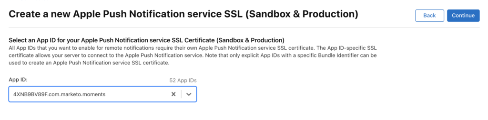

# Pushmeldingen

Uitleg over het inschakelen van pushmeldingen.

## Pushmelding instellen op iOS

Er zijn drie stappen om pushmeldingen in te schakelen:

1. Pushmeldingen configureren op Apple Developer Account.
1. Enable push notifications in xCode.
1. Schakel pushmeldingen in in de app met Marketo SDK.

### Pushmeldingen configureren op Apple Developer Account

1. Logboek in het Centrum van het Lid van de Ontwikkelaar van Apple [ ](http://developer.apple.com/membercenter).
1. Klik op Certificaten, id&#39;s en profielen.
1. Klik op de map &quot;Certificates->All&quot; onder &quot;iOS, tvOS, watchOS&quot;.
1. Selecteer &quot;+&quot; in het linkerbovenscherm naast certificaten 
1. Schakel het selectievakje &quot;Apple Push Notification service SSL (Sandbox &amp; Production)&quot; in en klik op &quot;Doorgaan&quot;.
1. Selecteer de toepassings-id die u gebruikt om de app te maken.
1. CSR maken en uploaden om het pushcertificaat te genereren. 
1. Certificaat downloaden naar lokale computer en dubbelklikken om te installeren. 
1. Open &quot;Keychain Access&quot;, klik met de rechtermuisknop op het certificaat en exporteer 2 items naar het `.p12` -bestand.
1. Upload dit bestand via Marketo Admin Console om meldingen te configureren.
1. App-inrichtingsprofielen bijwerken.

### Enable Push Notifications in xCode

Zet het vermogen van de pushmelding in xCode project aan.

### Enable Push Notifications in App with Marketo SDK

Voeg de volgende code toe aan het `AppDelegate.m` -bestand om pushberichten te verzenden naar de apparaten van uw klant.

**Nota** - als het gebruiken van de [!DNL Adobe Launch] uitbreiding, gebruik `ALMarketo` als classname

Importeren na in `AppDelegate.h` .

>[!BEGINTABS]

>[!TAB  Doelstelling C ]

```
#import <UserNotifications/UserNotifications.h>
```

>[!TAB  Swift ]

```
import UserNotifications
```

>[!ENDTABS]

Voeg `UNUserNotificationCenterDelegate` toe aan `AppDelegate`, zoals hieronder wordt weergegeven.

>[!BEGINTABS]

>[!TAB  Doelstelling C ]

```
@interface AppDelegate : UIResponder <UIApplicationDelegate, UNUserNotificationCenterDelegate>
```

>[!TAB  Swift ]

```
class AppDelegate: UIResponder, UIApplicationDelegate , UNUserNotificationCenterDelegate
```

>[!ENDTABS]

Inleiding pushmeldingenservice. Voeg onder code toe om pushberichten in te schakelen.

>[!BEGINTABS]

>[!TAB  Doelstelling C ]

```objectivec
BOOL)application:(UIApplication *)application didFinishLaunchingWithOptions:(NSDictionary *)launchOptions {
UNUserNotificationCenter *center = [UNUserNotificationCenter currentNotificationCenter];
        center.delegate = self;
        [center requestAuthorizationWithOptions:(UNAuthorizationOptionSound | UNAuthorizationOptionAlert | UNAuthorizationOptionBadge) completionHandler:^(BOOL granted, NSError * _Nullable error){
            if(!error){
                dispatch_async(dispatch_get_main_queue(), ^{
                    [[UIApplication sharedApplication] registerForRemoteNotifications];
                });
            }
        }];

    return YES;
}
```

>[!TAB  Swift ]

```
func application(_ application: UIApplication, didFinishLaunchingWithOptions launchOptions: [UIApplication.LaunchOptionsKey: Any]?) -> Bool {

    UNUserNotificationCenter.current().requestAuthorization(options: [.alert, .sound,    .badge]) { granted, error in
            if let error = error {
                print("\(error.localizedDescription)")
            } else {
                DispatchQueue.main.async {
                    application.registerForRemoteNotifications()
                }
            }
        }

        return true
}
```

>[!ENDTABS]

Roep deze methode aan om het registratieproces met Apple Push Service in werking te stellen. Als de registratie slaagt, roept de app de methode `application:didRegisterForRemoteNotificationsWithDeviceToken:` van het gedelegeerde object van uw App aan en geeft deze het apparaattoken door.

Als de registratie mislukt, roept de app in plaats daarvan de methode `application:didFailToRegisterForRemoteNotificationsWithError:` van de gedelegeerde van de app aan.

Registreer pushtoken bij Marketo. Als u pushberichten van Marketo wilt ontvangen, moet u het apparaattoken registreren bij Marketo.

>[!BEGINTABS]

>[!TAB  Doelstelling C ]

```
- (void)application:(UIApplication *)application didRegisterForRemoteNotificationsWithDeviceToken:(NSData *)deviceToken {
    // Register the push token with Marketo
    [[Marketo sharedInstance] registerPushDeviceToken:deviceToken];
}
```

>[!TAB  Swift ]

```
func application(_ application: UIApplication, didRegisterForRemoteNotificationsWithDeviceToken deviceToken: Data) {
    // Register the push token with Marketo
    Marketo.sharedInstance().registerPushDeviceToken(deviceToken)
}
```

>[!ENDTABS]

Het token kan ook niet worden geregistreerd wanneer de gebruiker zich afmeldt.

>[!BEGINTABS]

>[!TAB  Doelstelling C ]

```
[[Marketo sharedInstance] unregisterPushDeviceToken];
```

>[!TAB  Swift ]

```
Marketo.sharedInstance().unregisterPushDeviceToken
```

>[!ENDTABS]

Om het duptoken opnieuw te registreren haalt de code uit stap 3 in een methode AppDelegate en roept van de ViewController login methode.

Druk op pushmelding. Als u pushberichten van Marketo wilt ontvangen, moet u het apparaattoken registreren bij Marketo.

>[!BEGINTABS]

>[!TAB  Doelstelling C ]

```
- (void)application:(UIApplication *)application didReceiveRemoteNotification:(NSDictionary *)userInfo
{
    [[Marketo sharedInstance] handlePushNotification:userInfo];
}
```

>[!TAB  Swift ]

```
func application(_ application: UIApplication, didReceiveRemoteNotification userInfo: [AnyHashable : Any]) {
    Marketo.sharedInstance().handlePushNotification(userInfo)
}
```

>[!ENDTABS]

Voeg de volgende methode in AppDelegate toe

Met deze methode kunt u een waarschuwing, geluid of een hogere badge weergeven terwijl de app op de voorgrond staat. U moet completionHandler van uw keus in deze Methode roepen.

>[!BEGINTABS]

>[!TAB  Doelstelling C ]

```
-(void)userNotificationCenter:(UNUserNotificationCenter *)center
    willPresentNotification:(UNNotification *)notification
        withCompletionHandler:(void (^)(UNNotificationPresentationOptions options))completionHandler{

    completionHandler(UNAuthorizationOptionSound | UNAuthorizationOptionAlert | UNAuthorizationOptionBadge);
}
```

>[!TAB  Swift ]

```
func userNotificationCenter(_ center: UNUserNotificationCenter,
            willPresent notification: UNNotification, withCompletionHandler completionHandler: @escaping (
    UNNotificationPresentationOptions) -> Void) {
    completionHandler([.alert, .sound,.badge])
}
```

>[!ENDTABS]

Pas ontvangen pushmelding verwerken in AppDelegate

De methode zal op de afgevaardigde worden geroepen wanneer de gebruiker op het bericht door de toepassing te openen antwoordde, het bericht te ontslaan of een UNNotificationAction te kiezen. De afgevaardigde moet worden geplaatst alvorens de toepassing van applicationDoesFinishLaunching terugkeert:.

>[!BEGINTABS]

>[!TAB  Doelstelling C ]

```
- (void)userNotificationCenter:(UNUserNotificationCenter *)center
didReceiveNotificationResponse:(UNNotificationResponse *)response withCompletionHandler:(void(^)(void))completionHandler {
    [[Marketo sharedInstance] userNotificationCenter:center didReceiveNotificationResponse:response withCompletionHandler:completionHandler];
}
```

>[!TAB  Swift ]

```
func userNotificationCenter(_ center: UNUserNotificationCenter,
                                didReceive response: UNNotificationResponse,
                                withCompletionHandler
                                completionHandler: @escaping () -> Void) {
        Marketo.sharedInstance().userNotificationCenter(center, didReceive: response, withCompletionHandler: completionHandler)
}
```

>[!ENDTABS]

Pushmeldingen bijhouden

Als uw app op de achtergrond wordt uitgevoerd (of niet actief is), ontvangt het apparaat een pushmelding zoals hieronder wordt weergegeven. Marketo houdt bij wanneer de gebruiker op het bericht tikt.


Als het apparaat een pushmelding ontvangt, wordt deze doorgegeven aan `application:didReceiveRemoteNotification:` callback op uw App-gedelegeerde.

Hieronder volgt een Marketo-activiteitenlogboek van Marketo waarin gebeurtenissen voor apps en pushmeldingen worden weergegeven.


## Pushmelding instellen op Android

1. Voeg de volgende machtigingen toe in de tag application.

   Open `AndroidManifest.xml` en voeg de volgende machtigingen toe. Uw app moet om de toestemmingen &quot;INTERNET&quot;en &quot;ACCESS_NETWORK_STATE&quot;verzoeken. Als uw toepassing al om deze machtigingen vraagt, slaat u deze stap over.

   ```xml
   <uses‐permission android:name="android.permission.INTERNET"/>
   <uses‐permission android:name="android.permission.ACCESS_NETWORK_STATE"/>
   
   <!‐‐Following permissions are required for push notification.‐‐>
   <uses-permission android:name="android.permission.GET_ACCOUNTS"/>
   <!‐‐Keeps the processor from sleeping when a message is received.‐‐>
   <uses-permission android:name="android.permission.WAKE_LOCK"/>
   <permission android:name="<PACKAGE_NAME>.permission.C2D_MESSAGE" android:protectionLevel="signature" />
   <uses-permission android:name="<PACKAGE_NAME>.permission.C2D_MESSAGE" />
   <!-- This app has permission to register and receive data message. -->
   <uses-permission android:name="com.google.android.c2dm.permission.RECEIVE" />
   ```

1. De vestiging FCM met HTTPv1 (Google heeft [ verouderd protocol XMPP ](https://firebase.google.com/docs/cloud-messaging/xmpp-server-ref) op 12 Juni, 2023 en zal in Juni 2024 worden verwijderd)

- MME FCM HTTPv1 inschakelen in Marketo-functiebeheer 
   - Upload Service Account Json-bestand voor de toepassing in MLM.
   - U kunt het JSON-bestand voor serviceaccount downloaden van Firebase Console.   
   - Wacht een uur na het uploaden van het Json-bestand voor serviceaccount in Marketo voordat u pushberichten verzendt.  

## Android-testapparaten

Voeg Marketo Activity toe in manifestbestand in toepassingstag.

```xml
<activity android:name="com.marketo.MarketoActivity"  android:configChanges="orientation|screenSize">
    <intent-filter android:label="MarketoActivity">
        <action  android:name="android.intent.action.VIEW"/>
        <category  android:name="android.intent.category.DEFAULT"/>
        <category  android:name="android.intent.category.BROWSABLE"/>
        <data android:host="add_test_device" android:scheme="mkto"/>
    </intent-filter/>
</activity/>
```

## Marketo Push Service registreren

1. Als u pushberichten van Marketo wilt ontvangen, moet u de Firebase-berichtenservice toevoegen aan uw `AndroidManifest.xml` . Voeg toe vóór de afsluitende toepassingstag.

   ```xml
   <meta-data
       android:name="com.google.android.gms.version"
       android:value="@integer/google_play_services_version" />
   <service android:name=".MyFirebaseMessagingService">
   <intent-filter>
   <action android:name="com.google.firebase.INSTANCE_ID_EVENT"/>
   <action android:name="com.google.firebase.MESSAGING_EVENT"/>
   </intent-filter>
   </service>
   ```

1. Marketo SDK-methoden als volgt toevoegen aan het bestand `MyFirebaseMessagingService`

   ```java
   import com.marketo.Marketo;
   
   public class MyFirebaseMessagingService extends FirebaseMessagingService {
   
       @Override
       public void onNewToken(String s) {
           super.onNewToken(s);
           Marketo marketoSdk = Marketo.getInstance(this.getApplicationContext());
           marketoSdk.setPushNotificaitonToken(s);
           // Add your code here...
       }
   
       @Override
       public void onMessageReceived(RemoteMessage remoteMessage) {
           Marketo marketoSdk = Marketo.getInstance(this.getApplicationContext());
           marketoSdk.showPushNotificaiton(remoteMessage);
           // Add your code here...
       }
   
   }
   ```

   **Nota** - als het gebruiken van de uitbreiding van Adobe, voeg zoals hieronder toe

   ```java
   import com.marketo.Marketo;
   
   public class MyFirebaseMessagingService extends FirebaseMessagingService {
   
       @Override
       public void onNewToken(String token) {
           super.onNewToken(token);
           ALMarketo.setPushNotificationToken(token);
           // Add your code here...
       }
   
       @Override
       public void onMessageReceived(RemoteMessage remoteMessage) {
           ALMarketo.showPushNotification(remoteMessage);
           // Add your code here...
       }
   
   }
   ```

**NOTA**: FCM SDK voegt automatisch alle vereiste toestemmingen evenals de vereiste ontvangerfunctionaliteit toe. Verwijder de volgende verouderde (en mogelijk schadelijke) elementen uit het manifest van uw app als u eerdere versies van SDK hebt gebruikt

```xml
<receiver android:name="com.marketo.MarketoBroadcastReceiver" android:permission="com.google.android.c2dm.permission.SEND">
    <intent-filter>
        <!‐‐Receives the actual messages.‐‐>
        <action android:name="com.google.android.c2dm.intent.RECEIVE"/>
        <!‐‐Register to enable push notification‐‐>
        <action android:name="com.google.android.c2dm.intent.REGISTRATION"/>
        <!‐‐‐Replace YOUR_PACKAGE_NAME with your own package name‐‐>
        <category android:name="YOUR_PACKAGE_NAME"/>
    </intent-filter>
</receiver>

<!‐‐Marketo service to handle push registration and notification‐‐>
<service android:name="com.marketo.MarketoIntentService"/>
```

1. Initialiseer Marketo Push After saving the configuration above, you must initialize Marketo Push Notification. Maak of open de klasse Application en kopieer/plak de onderstaande code. U kunt uw afzender-id ophalen via de Firebase-console.

   ```java
   Marketo marketoSdk = Marketo.getInstance(getApplicationContext());
   
   // Enable push notification here. The push notification channel name can by any string
   marketoSdk.initializeMarketoPush(SENDER_ID,"ChannelName");
   ```

   Als u de extensie [!DNL Adobe Launch] gebruikt, gebruikt u deze instructies

   ```java
   // Enable push notification here. The push notification channel name can by any string
   ALMarketo.initializeMarketoPush(SENDER_ID,"ChannelName");
   ```

   Als u geen SENDER_ID hebt, dan laat de Dienst van het Overseinen van de Wolk van Google toe door de stappen te voltooien die in [ worden gedetailleerd dit leerprogramma ](https://developers.google.com/cloud-messaging/).

   Het token kan ook niet worden geregistreerd wanneer de gebruiker zich afmeldt.

   ```java
   marketoSdk.uninitializeMarketoPush();
   ```

   Gebruik de onderstaande instructies als u de extensie [!DNL Adobe Launch] gebruikt

   ```java
   ALMarketo.uninitializeMarketoPush();
   ```

   Nota: Om het duptoken te herregistreren extraheert de code uit stap 3 in een methode AppDelegate en roept van de ViewController login methode.

1. Stel Meldingspictogram in (optioneel) om een aangepast meldingspictogram te configureren. De volgende methode moet dan worden aangeroepen.

   ```java
   MarketoConfig.Notification config = new MarketoConfig.Notification();
   // Optional bitmap for honeycomb and above
   config.setNotificationLargeIcon(bitmap);
   
   // Required icon Resource ID
   config.setNotificationSmallIcon(R.drawable.notification_small_icon);
   
   // Set the configuration
   //Use the static methods on ALMarketo class when using Adobe Extension
   Marketo.getInstance(context).setNotificationConfig(config);
   
   // Get the configuration set
   Marketo.getInstance(context).getNotificationConfig();
   ```

## Problemen oplossen

Het opzetten van mobiele pushberichten omvat vele stappen en de coördinatie van ontwikkelaars en marketeers. Als u problemen ondervindt, kunt u een aantal eenvoudige dingen controleren.

Nadat u ervoor hebt gezorgd dat de eenvoudige dingen correct zijn, dan kunt u dieper in de programmeringsdetails graven.

### Het pushbericht wordt niet weergegeven

Controleer eerst of de pushberichten op de handset zijn uitgeschakeld. Mobiele gebruikers kunnen bepalen of ze berichten voor een bepaalde app ontvangen of niet. Vaak zullen ontwikkelaars (en marketers) deze berichten op een bepaald punt tijdens ontwikkeling onbruikbaar maken. Het eerste wat u moet controleren is of de ontvanger pushberichten voor uw app heeft uitgeschakeld.

Ten tweede: is de toepassing al geopend en actief op het apparaat? Wanneer uw app de actieve app op het apparaat is, verschijnen er geen mobiele pushberichten op het scherm. In plaats daarvan worden ze weergegeven in het gebied Lokale meldingen van uw app.

### De activiteitenlogboeken in Marketo weergeven

De eerste plaats om te kijken wanneer het volgen van een fout is in de logboeken van de Activiteit van Marketo. U kunt activiteitenlogboeken gebruiken om te verifiëren dat een bericht werd verzonden.

In het activiteitenlogboek, bekijk de activiteitenverslagen voor een persoon die een bericht verondersteld werd te ontvangen. Als het bericht werd verzonden, zal er een verslag aanwezig in het activiteitenlogboek zijn. Als dat niet het geval is, is het probleem waarschijnlijk het gevolg van de configuratie van het iOS-certificaat of de Android API-sleutel in Marketo.

### Certificaat of sleutel is ongeldig

Controleer uw configuratie tweemaal om ervoor te zorgen dat u het juiste die certificaat voor Sandbox of Productie hebt wordt geladen. Soms is het beter dat de ontwikkelaar de certificaten (iOS) of toetsen (Android) opnieuw exporteert en deze vervolgens opnieuw laadt in Marketo om te controleren of ze correct zijn.

### .p12-bestand ontbreekt een certificaat of sleutel (iOS)

Wanneer u het certificaat uitvoert, zorg ervoor dat u de sleutel _en_ het certificaat uitvoert.

### Provisioning Profiles Out-of-Date (iOS)

Wanneer u een nieuw apparaat toevoegt, moet u uw inrichtingsprofielen bijwerken en nieuwe certificaten genereren. Zorg ervoor dat uw Xcode-project vervolgens naar de juiste profielen en certificaten verwijst en importeer die certificaten in Marketo.

### Kan iOS-certificaat niet uploaden (IOS)

Zorg ervoor dat het wachtwoord dat wordt gebruikt tijdens het exporteren van het certificaat geen spaties bevat.  In plaats van deze:

`Hello World 123`

gebruik dit:

`HelloWorld123`

### Problemen met iOS-certificaten oplossen

Voor sandboxtoepassingen kunt u een certificaat &quot;developer&quot; of &quot;Universal&quot; gebruiken. Maar voor productietoepassingen moet u een geldig &quot;distributie&quot;of &quot;universeel&quot;certificaat uploaden.

### Stuiteren/Ongeldige token

Een bestaand registratietoken kan in een aantal scenario&#39;s niet langer geldig zijn, zoals:

- Als de clienttoepassing zich niet bij GCM registreert.
- Als de clienttoepassing automatisch niet wordt geregistreerd, wat kan gebeuren als de gebruiker de toepassing verwijdert. Op iOS bijvoorbeeld, als de APNS-feedbackservice het APNS-token als ongeldig heeft gerapporteerd.
- Als de registratietoken verloopt. Google kan bijvoorbeeld besluiten om registratietokens te vernieuwen of de APNS-token is verlopen voor iOS-apparaten.
- Als de client-app is bijgewerkt maar de nieuwe versie niet is geconfigureerd voor het ontvangen van berichten.
