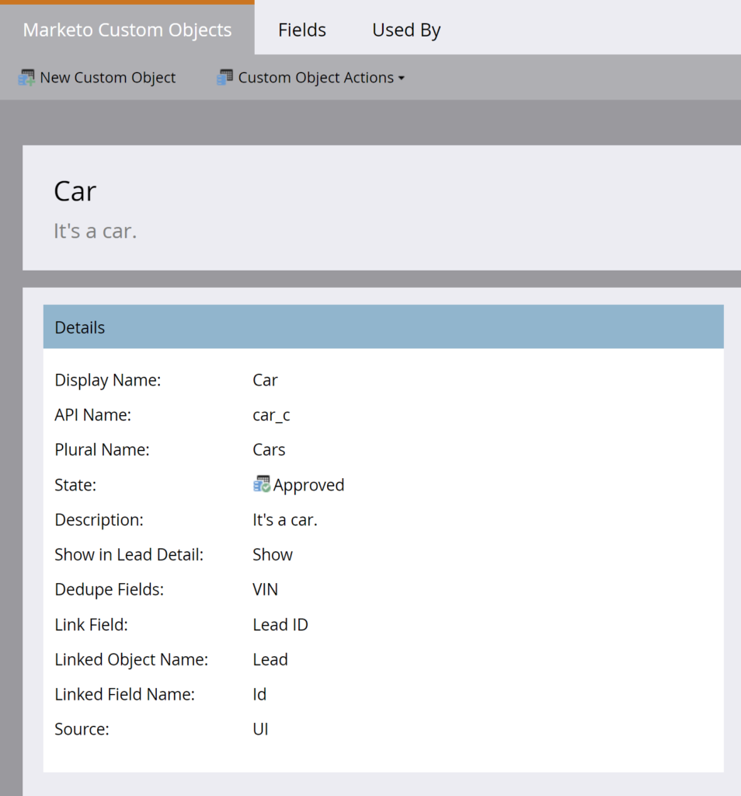

# Bulk aangepast object extraheren

[Verwijzing naar eindpunt van aangepast object extraheren](https://developer.adobe.com/marketo-apis/api/mapi/#tag/Bulk-Export-Custom-Objects)

De Bulk reeks van het Uittreksel van de Objecten van de Douane van het Bulk van REST APIs verstrekt een programmatic interface voor het terugwinnen van grote reeksen van douaneobjecten verslagen uit Marketo. Dit is de aanbevolen interface voor gebruiksgevallen die een continue uitwisseling van gegevens tussen Marketo en een of meer externe systemen vereisen, voor ETL-, data warehousing- en archiefdoeleinden.

Deze API ondersteunt het exporteren van Marketo-records van het eerste niveau die rechtstreeks zijn gekoppeld aan een lead. Geef de naam van het aangepaste object door en een lijst met leads waaraan het object is gekoppeld. Voor elke lead in de lijst worden de gekoppelde aangepaste objectrapporten die overeenkomen met de opgegeven aangepaste objectnaam, als rijen naar het exportbestand geschreven. Aangepaste objectgegevens kunnen worden weergegeven in het dialoogvenster [Tabblad Aangepast object van de detailpagina van de lead in de gebruikersinterface van Marketo](https://experienceleague.adobe.com/en/docs/marketo/using/product-docs/administration/marketo-custom-objects/understanding-marketo-custom-objects).

## Machtigingen

De Bulk APIs van het Uittreksel van de Objecten van de Douane vereist dat de gebruiker API een rol met één of allebei van &quot;Read-Only Douane Voorwerp&quot;, of &quot;Read-Write de toestemmingen van de Douane van het Voorwerp&quot;heeft.

## Filters

Extraheren van aangepaste objecten ondersteunt verschillende filteropties die worden gebruikt om een lijst met leads op te geven die aan het aangepaste object zijn gekoppeld. Als een lead in de lijst is gekoppeld aan aangepaste-objectrapporten die overeenkomen met een bepaalde aangepaste objectnaam, worden de records naar het exportbestand geschreven. Per exporttaak kan slechts één filtertype worden opgegeven.

| Filtertype | Gegevenstype | Notities |
|---|---|---|
| `updatedAt` | Datumbereik | Accepteert een JSON-object met de leden `startAt` en `endAt` &amp;nbsp.;`startAt` een datetime accepteert die het lage watermerk vertegenwoordigt, en `endAt` accepteert een datetime die het hoge watermerk vertegenwoordigt. Het bereik moet 31 dagen of minder zijn. Taken met dit filtertype retourneren alle toegankelijke records die binnen het datumbereik zijn bijgewerkt. Datumtijden moeten een ISO-8601-indeling hebben, zonder milliseconden. |
| `staticListName` | String | Accepteert de naam van een statische lijst. Taken met dit filtertype retourneren alle toegankelijke records die lid zijn van de statische lijst op het moment dat de taak wordt verwerkt. Haal statische lijstnamen terug gebruikend het Get eindpunt van Lijsten. |
| `staticListId` | Geheel | Accepteert de id van een statische lijst. Taken met dit filtertype retourneren alle toegankelijke records die lid zijn van de statische lijst op het moment dat de taak wordt verwerkt. Haal statische lijstitems terug gebruikend het Get eindpunt van Lijsten. |
| `smartListName`* | String | Accepteert de naam van een slimme lijst. Taken met dit filtertype retourneren alle toegankelijke records die lid zijn van de slimme lijsten op het moment dat de taak wordt verwerkt. Haal slimme lijstnamen terug gebruikend het Get Slimme eindpunt van Lijsten. |
| `smartListId`* | Geheel | Accepteert de id van een slimme lijst. Taken met dit filtertype retourneren alle toegankelijke records die lid zijn van de slimme lijsten op het moment dat de taak wordt verwerkt. Haal slimme lijstitems terug gebruikend het Get Slimme eindpunt van Lijsten. |

Filtertype is niet beschikbaar voor alle abonnementen. Als deze optie niet beschikbaar is voor uw abonnement, wordt een fout weergegeven wanneer u het eindpunt Taak voor lead exporteren aanroept (&quot;1035, Niet-ondersteund filtertype voor doelabonnement&quot;). Klanten kunnen contact opnemen met Marketo Support om deze functionaliteit in hun abonnement te laten inschakelen.

## Opties

De [Aangepaste objecttaak exporteren](https://developer.adobe.com/marketo-apis/api/mapi/#tag/Bulk-Export-Custom-Objects/operation/createExportCustomObjectsUsingPOST) biedt het eindpunt verschillende opmaakopties. Met deze opties kan de gebruiker:

- Geef de velden op die u wilt opnemen in het geëxporteerde bestand
- De naam van kolomkoppen in deze velden wijzigen
- De indeling van het geëxporteerde bestand opgeven

| Parameter | Gegevenstype | Vereist | Notities |
|---|---|---|---|
| `fields` | Array[String] | Ja | Array met tekenreeksen die de waarde van de kenmerknaam van een aangepast object bevat, zoals geretourneerd door het eindpunt van een aangepast object beschrijven. De weergegeven velden worden opgenomen in het geëxporteerde bestand. |
| `columnHeaderNames` | Object | Nee | Een JSON-object met sleutelwaardeparen van veld- en kolomkopnamen. De sleutel moet de naam zijn van een veld dat is opgenomen in de exporttaak. De waarde is de naam van de geëxporteerde kolomkop voor dat veld. |
| `format` | String | Nee | Accepteert één van: CSV, TSV, SSV. Het geëxporteerde bestand wordt gerenderd als een bestand met door komma&#39;s gescheiden waarden, door tabs gescheiden waarden of door spaties gescheiden waarden, indien ingesteld. De standaardwaarde is CSV als de waarde is uitgeschakeld. |


## Een taak maken

De parameters voor de taak worden gedefinieerd voordat de exportbewerking wordt gestart met de opdracht [Aangepaste objecttaak exporteren](https://developer.adobe.com/marketo-apis/api/mapi/#tag/Bulk-Export-Custom-Objects/operation/createExportCustomObjectsUsingPOST) eindpunt.

De vereiste `apiName` padparameter is de aangepaste objectnaam die door de [Beschrijf aangepast object](https://developer.adobe.com/marketo-apis/api/mapi/#tag/Custom-Objects/operation/describeUsingGET_1) eindpunt. Hiermee geeft u aan welk aangepast Marketo-object u wilt exporteren. Aangepaste CRM-objecten zijn niet toegestaan. De vereiste `filter` bevat de lijst met leads die zijn gekoppeld aan het aangepaste object. Dit kan verwijzen naar een statische lijst, of een slimme lijst. De vereiste `fields` bevat de API-namen van de aangepaste objectkenmerken die in het exportbestand moeten worden opgenomen. Optioneel kunnen we de `format` van het bestand en de `columnHeaderNames`.

Als voorbeeld, veronderstellen wij dat wij een douanevoorwerp genoemd &quot;Auto&quot;met de volgende gebieden hebben gecreeerd: Kleur, Merk, Model, VIN. Het koppelingsveld is de hoofd-id en het veld voor deduplicatie is VIN.

Aangepaste objectdefinitie




Aangepaste objectvelden


We kunnen bellen [Beschrijf aangepast object](https://developer.adobe.com/marketo-apis/api/mapi/#tag/Custom-Objects/operation/describeUsingGET_1) om de kenmerken van aangepaste objecten die worden weergegeven in het dialoogvenster `fields` in de reactie.

```
GET /rest/v1/customobjects/car_c/describe.json
```

```json
{
    "requestId": "148ef#1793e00f64f",
    "result": [
        {
            "name": "car_c",
            "displayName": "Car",
            "description": "It's a car.",
            "createdAt": "2021-05-05T16:14:41Z",
            "updatedAt": "2021-05-05T16:14:42Z",
            "idField": "marketoGUID",
            "dedupeFields": [
                "vIN"
            ],
            "searchableFields": [
                [
                    "vIN"
                ],
                [
                    "marketoGUID"
                ],
                [
                    "leadID"
                ]
            ],
            "relationships": [
                {
                    "field": "leadID",
                    "type": "child",
                    "relatedTo": {
                        "name": "Lead",
                        "field": "Id"
                    }
                }
            ],
            "fields": [
                {
                    "name": "createdAt",
                    "displayName": "Created At",
                    "dataType": "datetime",
                    "updateable": false,
                    "crmManaged": false
                },
                {
                    "name": "marketoGUID",
                    "displayName": "Marketo GUID",
                    "dataType": "string",
                    "length": 36,
                    "updateable": false,
                    "crmManaged": false
                },
                {
                    "name": "updatedAt",
                    "displayName": "Updated At",
                    "dataType": "datetime",
                    "updateable": false,
                    "crmManaged": false
                },
                {
                    "name": "color",
                    "displayName": "Color",
                    "dataType": "string",
                    "length": 255,
                    "updateable": true,
                    "crmManaged": false
                },
                {
                    "name": "leadID",
                    "displayName": "Lead ID",
                    "dataType": "integer",
                    "updateable": true,
                    "crmManaged": false
                },
                {
                    "name": "make",
                    "displayName": "Make",
                    "dataType": "string",
                    "length": 255,
                    "updateable": true,
                    "crmManaged": false
                },
                {
                    "name": "model",
                    "displayName": "Model",
                    "dataType": "string",
                    "length": 255,
                    "updateable": true,
                    "crmManaged": false
                },
                {
                    "name": "vIN",
                    "displayName": "VIN",
                    "dataType": "string",
                    "length": 255,
                    "updateable": true,
                    "crmManaged": false
                }
            ]
        }
    ],
    "success": true
}
```

Maak meerdere aangepaste objectrapporten en koppel deze aan een andere lead met de opdracht [Aangepaste objecten synchroniseren](https://developer.adobe.com/marketo-apis/api/mapi/#tag/Custom-Objects/operation/syncCustomObjectsUsingPOST) eindpunt. Eén lead kan worden gekoppeld aan een groot aantal records met aangepaste objecten. Dit wordt een &#39;één op velen&#39;-relatie genoemd.

```
POST /rest/v1/customobjects/car_c.json
```

```json
{
   "action":"createOrUpdate",
   "input":[
       {
           "leadId": 11,
           "color": "Pearl White",
           "make": "Tesla",
           "model": "Model S",
           "vIN": "5YJSA1E41FF156789"
       },
       {
           "leadId": 12,
           "color": "Midnight Silver Metallic",
           "make": "Tesla",
           "model": "Model X",
           "vIN": "LRWXB2B41FF198765"
       },
       {
           "leadId": 13,
           "color": "Fusion Red",
           "make": "Tesla",
           "model": "Roadster",
           "vIN": "SFGRC3C41FF154321"
       }
    ]
}
```

```json
{
    "requestId": "50d9#1793e066088",
    "result": [
        {
            "seq": 0,
            "marketoGUID": "d911eaa1-fd0b-4a99-9b71-c6a7233c782c",
            "status": "created"
        },
        {
            "seq": 1,
            "marketoGUID": "20d04ffb-51f0-4336-924c-c783b9bb4215",
            "status": "created"
        },
        {
            "seq": 2,
            "marketoGUID": "e7da4331-8e7a-473b-85c8-047638eb6c7f",
            "status": "created"
        }
    ],
    "success": true
}
```

Elk van de drie hierboven genoemde leads behoort tot een statische lijst met de naam &quot;Auto Buyers&quot; waarvan `id` is 1081 zoals hieronder kan worden gezien door te roepen [Leden ophalen op lijst-id](https://developer.adobe.com/marketo-apis/api/mapi/#tag/Static-Lists/operation/getLeadsByListIdUsingGET_1) eindpunt.

```
GET /rest/v1/lists/1081/leads.json
```

```json
{
    "requestId": "d023#1793e1e982b",
    "result": [
        {
            "id": 11,
            "firstName": "Hanna",
            "lastName": "Crawford",
            "email": "208161Hanna.Crawford@pookmail.com",
            "updatedAt": "2020-01-16T02:38:22Z",
            "createdAt": "2017-07-27T01:38:42Z"
        },
        {
            "id": 12,
            "firstName": "Bertha",
            "lastName": "Fulton",
            "email": "208160Bertha.Fulton@trashymail.com",
            "updatedAt": "2020-01-16T02:38:22Z",
            "createdAt": "2017-07-27T01:38:42Z"
        },
        {
            "id": 13,
            "firstName": "Faith",
            "lastName": "England",
            "email": "208159Faith.England@dodgit.com",
            "updatedAt": "2020-01-16T02:38:22Z",
            "createdAt": "2017-07-27T01:38:42Z"
        }
    ],
    "success": true
}
```

Laten we nu een exporttaak maken om deze records op te halen. Met de [Aangepaste objecttaak exporteren](https://developer.adobe.com/marketo-apis/api/mapi/#tag/Bulk-Export-Custom-Objects/operation/createExportCustomObjectsUsingPOST) eindpunt, specificeren wij douaneobjecten attributen in `fields` parameter en een statische lijst-id in het dialoogvenster `filter` parameter.

```
POST /bulk/v1/customobjects/car_c/export/create.json
```

```json
{
    "fields": [
        "leadId",
        "color",
        "make",
        "model",
        "vIN"
    ],
    "filter": {
        "staticListId": 1081
    }
}
```

```json
{
    "requestId": "8d2f#1793e289e87",
    "result": [
        {
            "exportId": "f2c03f1d-226f-47c1-a557-357af8c2b32a",
            "format": "CSV",
            "status": "Created",
            "createdAt": "2021-05-05T20:12:01Z"
        }
    ],
    "success": true
}
```

Dit retourneert een status in de reactie die aangeeft dat de taak is gemaakt. De taak is gedefinieerd en gemaakt, maar is nog niet uitgeschakeld. Daartoe [Aangepaste objecttaak exporteren](https://developer.adobe.com/marketo-apis/api/mapi/#tag/Bulk-Export-Custom-Objects/operation/enqueueExportCustomObjectsUsingPOST) het eindpunt moet worden geroepen gebruikend `apiName`en de `exportId` uit de reactie op de aanmaakstatus.

```
POST /bulk/v1/customobjects/car_c/export/f2c03f1d-226f-47c1-a557-357af8c2b32a/enqueue.json
```

```json
{
    "requestId": "cfaf#1793e2a0762",
    "result": [
        {
            "exportId": "f2c03f1d-226f-47c1-a557-357af8c2b32a",
            "format": "CSV",
            "status": "Queued",
            "createdAt": "2021-05-05T20:12:01Z",
            "queuedAt": "2021-05-05T20:13:32Z"
        }
    ],
    "success": true
}
```

Dit reageert met een eerste `status` van &quot;In de wachtrij geplaatst&quot; waarna deze is ingesteld op &quot;Verwerking&quot; wanneer er een beschikbare exportsleuf is.

## Status opiniepeilingtaak

De status kan alleen worden opgehaald voor taken die door dezelfde API-gebruiker zijn gemaakt.

Aangezien dit een asynchroon eindpunt is, moeten wij na het creëren van de baan zijn status onderzoeken om zijn vooruitgang te bepalen. Opiniepeiling met de opdracht [Taakstatus van aangepast object exporteren](https://developer.adobe.com/marketo-apis/api/mapi/#tag/Bulk-Export-Custom-Objects/operation/getExportCustomObjectsStatusUsingGET) eindpunt. De status wordt slechts eenmaal om de 60 seconden bijgewerkt, dus een lagere stemfrequentie dan dit wordt aanbevolen, en in bijna alle gevallen is dit nog steeds buitensporig. Het statusveld kan reageren met elk van de volgende opties: Gemaakt, In wachtrij geplaatst, Verwerken, Geannuleerd, Voltooid of Mislukt.

```
GET /bulk/v1/customobjects/{apiName}/export/{exportId}/status.json
```

```json
{
    "requestId": "14daa#1793e2cf9de",
    "result": [
        {
            "exportId": "f2c03f1d-226f-47c1-a557-357af8c2b32a",
            "format": "CSV",
            "status": "Processing",
            "createdAt": "2021-05-05T20:12:01Z",
            "queuedAt": "2021-05-05T20:13:32Z",
            "startedAt": "2021-05-05T20:14:15Z"
        }
    ],
    "success": true
}
```

Het statuseindpunt antwoordt erop wijzend dat de baan nog verwerkt, zodat is het dossier nog niet beschikbaar voor terugwinning. Eenmaal de taak `status` Als de waarde &quot;Voltooid&quot; is, kan deze worden gedownload.

```json
{
    "requestId": "14daa#1793e2cf9de",
    "result": [
        {
            "exportId": "f2c03f1d-226f-47c1-a557-357af8c2b32a",
            "format": "CSV",
            "status": "Completed",
            "createdAt": "2021-05-05T20:12:01Z",
            "queuedAt": "2021-05-05T20:13:32Z",
            "startedAt": "2021-05-05T20:14:15Z",
            "finishedAt": "2021-05-05T20:14:28Z",
            "numberOfRecords": 3,
            "fileSize": 182,
            "fileChecksum": "sha256:fac0cabc2352229c12e18b2fde03d1f24178bc71e9e926f520ae8d61bbe98c01"
        }
    ],
    "success": true
}
```

## Uw gegevens ophalen

Als u het bestand van een voltooide exportbewerking van een aangepast object wilt ophalen, roept u de [Aangepast objectbestand exporteren](https://developer.adobe.com/marketo-apis/api/mapi/#tag/Bulk-Export-Custom-Objects/operation/getExportCustomObjectsFileUsingGET) eindpunt met uw `apiName` en `exportId`.

De reactie bevat een bestand dat is opgemaakt op de manier waarop de taak is geconfigureerd. Het eindpunt antwoordt met de inhoud van het dossier. Als een aangevraagd aangepast objectkenmerk leeg is (geen gegevens bevat), `null` wordt in het desbetreffende veld in het exportbestand geplaatst.

```
GET /bulk/v1/customobjects/car_c/export/f2c03f1d-226f-47c1-a557-357af8c2b32a/file.json
```

```csv
leadId,color,make,model,vIN
11,Pearl White,Tesla,Model S,5YJSA1E41FF156789
12,Midnight Silver Metallic,Tesla,Model X,LRWXB2B41FF198765
13,Fusion Red,Tesla,Roadster,SFGRC3C41FF154321
```

Om gedeeltelijke en hervattingsvriendelijke herwinning van gehaalde gegevens te steunen, steunt het dossiereindpunt naar keuze de de kopbalWaaier van HTTP van de typebytes. Als de header niet is ingesteld, wordt de gehele inhoud geretourneerd. U kunt meer lezen over het gebruik van de Range-header in Marketo [Bulk extraheren](bulk-extract.md).

## Een taak annuleren

Als een baan verkeerd werd gevormd, of onnodig wordt, kan het gemakkelijk worden geannuleerd gebruikend [Aangepaste objecttaak exporteren annuleren](https://developer.adobe.com/marketo-apis/api/mapi/#tag/Bulk-Export-Custom-Objects/operation/getExportCustomObjectsFileUsingPOST) eindpunt. Dit reageert met een `status` die aangeeft dat de taak is geannuleerd.

```
POST /bulk/v1/customobjects/car_c/export/f2c03f1d-226f-47c1-a557-357af8c2b32a/cancel.json
```

```json
{
    "requestId": "e5f9#179391286a7",
    "result": [
        {
            "exportId": "4a8cdd80-0d16-4dd6-9923-6ec97e30e91b",
            "format": "CSV",
            "status": "Cancelled",
            "createdAt": "2021-05-04T20:24:33Z"
        }
    ],
    "success": true
}
```
