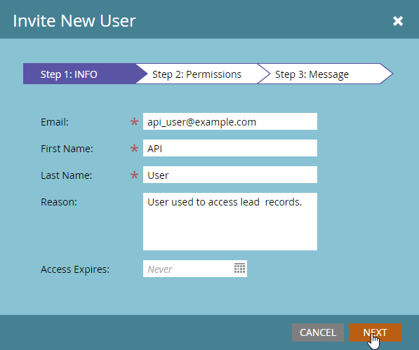

# Aangepaste services

A Custom Service biedt referenties voor verificatie met Marketo. Credentials zijn nodig om een toegangstoken van de Marketo te verkrijgen [Identiteitsservice](https://developer.adobe.com/marketo-apis/api/identity/#tag/Identity/operation/identityUsingGET). Elke Dienst van de Douane is scoped aan één enkele API-Enige gebruiker waarvan het zijn toestemmingen afleidt.

## Rollen

De eerste stap bij het maken van een aangepaste service is het maken van een rol die u kunt toepassen op de relevante gebruiker met alleen een API. Dit wordt gedaan van **[!UICONTROL Admin]** > **[!UICONTROL Users & Roles]** > **[!UICONTROL Roles]** -menu.

Rollen zijn containers voor individuele machtigingen die toegang tot bepaalde functies toestaan of beperken. Bij abonnementen waarvoor werkruimten en partities zijn ingeschakeld, worden machtigingen per werkruimte toegewezen. Als een gebruiker een machtiging heeft in de ene werkruimte, maar niet in de andere, kunnen hij of zij alleen toegestane acties uitvoeren in die werkruimte. Als u een rol wilt maken, klikt u op de knop Nieuwe rol.

Geef uw rol een beschrijvende naam. Gebruikers met alleen een API hebben een specifieke set machtigingen die apart staan en verschillen van normale gebruikersmachtigingen. API-machtigingen bevinden zich in hun eigen hiërarchie onder de structuur van de API voor toegang.

### Rolmachtigingen

Alleen machtigingen in de groep &quot;API voor toegang&quot; worden toegepast op API-gebruikers, dat wil zeggen dat het toewijzen van alle beheermachtigingen geen API-machtigingen aan een gebruiker verleent.

Wanneer u een rol samenstelt, moet u zorgvuldig overwegen welke handelingen u de toepassing moet toestaan om deze te gebruiken. Alleen de minimale set machtigingen toekennen die vereist is om die handelingen uit te voeren. Als u een onnodig permissieve set machtigingen toestaat, kunnen integraties ongewenste handelingen uitvoeren in uw abonnement. U kunt de [machtigingsgereedschap](endpoint-reference.md) om uw minimale reeks toestemmingen te bepalen. Zie de volledige lijst van [machtigingen](#permission_list).

## Gebruikers

Nadat u een rol hebt gemaakt, moet u een gebruiker met de eigenschap Alleen API maken. Gebruikers met alleen een API zijn een speciaal type gebruiker in Marketo, omdat ze worden beheerd door andere gebruikers en niet kunnen worden gebruikt om zich aan te melden bij Marketo. Gebruikers met alleen API kunnen:

- Aangepaste services maken
- Machtigingen voor het bereik van deze services
- Toegang tot REST API&#39;s

>[!MORELIKETHIS]
>
>Ga naar het **[!UICONTROL Admin]** > **[!UICONTROL Users & Roles]** > **[!UICONTROL Users]** menu en klik op [!UICONTROL Invite New User].

Geef uw gebruiker een beschrijvende naam en een e-mailadres (het moet ongeldig zijn), gebaseerd op de dienst en de toepassing waarvoor het zal worden gebruikt. Vul de vereiste velden in het dialoogvenster in, klik op het selectievakje Alleen API en wijs een van uw API-rollen toe aan de gebruiker. Hiermee worden de machtigingen van die rol toegewezen aan de gebruiker.

Klik tot slot op &quot;Verzenden&quot; om de gebruiker met alleen de API te maken.

Wanneer levering van een nieuwe toepassing met geloofsbrieven, denk sterk na makend een nieuwe gebruiker voor de dienst zelfs als het de zelfde toestemming heeft die wordt geplaatst zoals een andere bestaande integratie. De statistieken van het het vraaggebruik van API en de fouten worden bijgehouden op een per gebruikersbasis, zodat kan de levering van een gebruiker voor elke toepassing u helpen gebruik en kwesties aan specifieke toepassingen isoleren. Dit is handig als u problemen ondervindt met het bereiken van uw dagelijkse API-aanroeplimieten of fouten die het gevolg zijn van API-aanroepen die door integratie zijn gemaakt.

## Aangepaste services

De Diensten van de douane verstrekken de daadwerkelijke geloofsbrieven, identiteitskaart van de Cliënt en Geheim van de Cliënt, die worden vereist om Authentificatie met een instantie van Marketo uit te voeren. Ga naar uw **[!UICONTROL Admin]** > **[!UICONTROL Integrations]** > **[!UICONTROL LaunchPoint]** en selecteert u **[!UICONTROL New Service]**.

Geef uw dienst een beschrijvende naam en van de lijst van de &quot;Dienst&quot;selecteer &quot;Douane&quot;. Geef uw service een uitgebreide beschrijving en selecteer een geschikte gebruiker in de lijst Alleen API-gebruikers en klik vervolgens op [!UICONTROL Create].

Dit voegt een nieuwe dienst aan uw lijst van de diensten van LaunchPoint, en de optie aan &quot;Details van de Mening&quot;toe. Klik op &quot;Details weergeven&quot; en u krijgt de client-id en het clientgeheim die vereist zijn voor verificatie, de gebruiker die eigenaar is en een optie om token op te halen voor testdoeleinden op korte termijn. Het token dat u uit dit dialoogvenster krijgt, heeft dezelfde levensduur als tokens die normaal uit het dialoogvenster worden opgehaald [Identiteitsservice](https://developer.adobe.com/marketo-apis/api/identity/#tag/Identity/operation/identityUsingGET) en is geldig gedurende 3.600 seconden vanaf het aanmaken.

## Werkruimten en partities

Bij abonnementen met werkruimten en partities wordt de mogelijkheid om toegang te krijgen tot een bepaald record of middel verleend op basis van de machtigingen die de rol van een gebruiker in een bepaalde werkruimte heeft. Elke werkruimte krijgt toegang tot een of meer partities in het menu Werkruimten en Partities en een lead behoort tot één partitie. Als de gebruiker met alleen de API toegang heeft tot leadrecords in een werkruimte, kan deze alle records in partities openen waartoe die werkruimte toegang heeft.

Elementen horen bij werkruimten. De mogelijkheid om een element te lezen of te schrijven wordt dus bepaald door het feit of de gebruiker een rol heeft in de relevante werkruimte die gemachtigd is om dat type elementrecord in de werkruimte te lezen of te schrijven.

## Machtigingenlijst

Hieronder volgt een lijst met alle machtigingen die beschikbaar zijn voor gebruikers met alleen een API en de machtigingen die gebruikers met deze machtigingen kunnen verlenen.

| Rolmachtiging | Toegang verlenen tot... |
| --- | --- |
| Middelen goedkeuren | Elementen goedkeuren |
| Campagne uitvoeren | Een campagne aanvragen of plannen |
| Alleen-lezen activiteit | Leadactiviteiten ophalen |
| Metagegevens activiteit alleen-lezen | Metagegevens voor loodactiviteit ophalen |
| Alleen-lezen elementen | Elementdetails ophalen |
| Alleen-lezen campagne | Campagnegegevens ophalen |
| Alleen-lezen bedrijf | Bedrijfsgegevens ophalen |
| Alleen-lezen aangepast object | Aangepaste objectdetails ophalen |
| Lead, alleen-lezen | Belangrijkste gegevens ophalen |
| Benoemd account (alleen-lezen) | Benoemde accountgegevens ophalen |
| Benoemde accountlijst, alleen-lezen | Gegevens uit de lijst met benoemde accounts ophalen |
| Opportunity, alleen-lezen | Details van opportuniteit ophalen |
| Alleen-lezen verkoper | Details van verkooppersoon ophalen |
| Leesschrijfactiviteit | Leidingsactiviteiten ophalen en maken |
| Metagegevens lezen/schrijven-activiteit | Metagegevens voor loodactiviteit ophalen en maken |
| Read-Write Middelen | Elementen ophalen, maken en bijwerken |
| Campagne voor schrijven | Campagnes ophalen, maken en bijwerken |
| Read-Write Bedrijf | Bedrijven ophalen, maken en bijwerken |
| Aangepast object lezen/schrijven | Aangepaste objecten ophalen, maken en bijwerken |
| Lead lezen | Belangrijkste details ophalen, maken en bijwerken |
| Benoemd account voor lezen/schrijven | Benoemde accounts ophalen, maken en bijwerken |
| Benoemde accountlijst lezen | Benoemde accountlijsten ophalen, maken en bijwerken |
| Opportunity voor lezen/schrijven | Mogelijkheden ophalen, maken en bijwerken |
| Verkooppersoon voor lezen/schrijven | Verkopers ophalen, maken en bijwerken |
