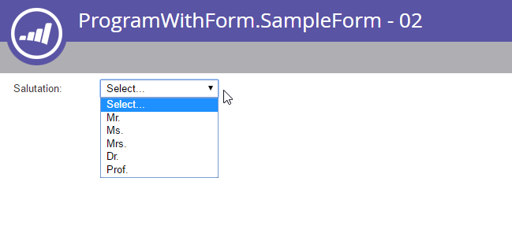

# Forms

[ Verwijzing van het Eindpunt van Forms ](https://developer.adobe.com/marketo-apis/api/asset/#tag/Forms)

[ Verwijzing van het Eindpunt van de Gebieden van de Vorm ](https://developer.adobe.com/marketo-apis/api/asset/#tag/Form-Fields)

Marketo-formulieren hebben een complexe reeks eindpunten die volledige controle mogelijk maken over formulierbeheer vanaf externe systemen. De structuur van formulieren kan complex zijn, omdat er veel verschillende typen objecten zijn die als onderdeel van een formulier moeten worden beheerd: Forms, Fields, Fieldsets, Visibility Rules en Follow-up Page Rules.

## Query

Forms steunt de standaardmethodes van activa terugwinning, [ door identiteitskaart ](https://developer.adobe.com/marketo-apis/api/asset/#tag/Forms/operation/getLpFormByIdUsingGET), [ door naam ](https://developer.adobe.com/marketo-apis/api/asset/#tag/Forms/operation/getLpFormByNameUsingGET), en [ door te doorbladeren ](https://developer.adobe.com/marketo-apis/api/asset/#tag/Forms/operation/browseForms2UsingGET). Elke formulierreactie bevat alle eigenschappen, behalve de veldlijst.

### Op ID

[ krijgt Vorm door Identiteitskaart ](https://developer.adobe.com/marketo-apis/api/asset/#tag/Forms/operation/getLpFormByIdUsingGET) neemt een vorm `id` als wegparameter en keert een vormverslag terug.

```
GET /rest/asset/v1/form/{id}.json
```

```json
{
    "success": true,
    "warnings": [],
    "errors": [],
    "requestId": "948f#154e3bad8e3",
    "result": [
        {
            "id": 736,
            "name": "newForm",
            "description": "test",
            "createdAt": "2016-05-24T17:05:54Z+0000",
            "updatedAt": "2016-05-24T17:05:54Z+0000",
            "url": "https://app-devlocal1.marketo.com/#FO736B2",
            "status": "draft",
            "theme": "simple",
            "language": "French",
            "locale": "fr_FR",
            "progressiveProfiling": false,
            "labelPosition": "left",
            "fontFamily": "Helvetica",
            "fontSize": "13px",
            "folder": {
                "type": "Folder",
                "value": 293,
                "folderName": "yyLNLHzgOM"
            },
            "knownVisitor": {
                "type": "form",
                "template": null
            },
            "thankYouList": [
                {
                    "followupType": "none",
                    "followupValue": null,
                    "default": true
                }
            ],
            "buttonLocation": 120,
            "buttonLabel": "Envoyer",
            "waitingLabel": "Veuillez patienter"
        }
    ]
}
```

### Op naam

[ krijgt Vorm door Naam ](https://developer.adobe.com/marketo-apis/api/asset/#tag/Forms/operation/getLpFormByNameUsingGET) neemt een vorm `name` als wegparameter en keert een vormverslag terug.

```
GET /rest/asset/v1/form/byName.json?name=newForm
```

```json
{
    "success": true,
    "warnings": [],
    "errors": [],
    "requestId": "948f#154e3bad8e3",
    "result": [
        {
            "id": 736,
            "name": "newForm",
            "description": "test",
            "createdAt": "2016-05-24T17:05:54Z+0000",
            "updatedAt": "2016-05-24T17:05:54Z+0000",
            "url": "https://app-devlocal1.marketo.com/#FO736B2",
            "status": "draft",
            "theme": "simple",
            "language": "French",
            "locale": "fr_FR",
            "progressiveProfiling": false,
            "labelPosition": "left",
            "fontFamily": "Helvetica",
            "fontSize": "13px",
            "folder": {
                "type": "Folder",
                "value": 293,
                "folderName": "yyLNLHzgOM"
            },
            "knownVisitor": {
                "type": "form",
                "template": null
            },
            "thankYouList": [
                {
                    "followupType": "none",
                    "followupValue": null,
                    "default": true
                }
            ],
            "buttonLocation": 120,
            "buttonLabel": "Envoyer",
            "waitingLabel": "Veuillez patienter"
        }
    ]
}
```

### Bladeren

[ krijgt Forms ](https://developer.adobe.com/marketo-apis/api/asset/#tag/Forms/operation/browseForms2UsingGET) vormen werken als andere activa API doorbladert eindpunten, en staat facultatieve het filtreren op `status`, `maxReturn`, en `offset` toe. De status kan zijn: goedgekeurd, goedgekeurd met concept of concept.

```
GET /rest/asset/v1/forms.json
```

```json
{
    "success": true,
    "warnings": [],
    "errors": [],
    "requestId": "645d#154e3d499ac",
    "result": [
        {
            "id": 227,
            "name": "aKAUVDfbsX",
            "description": "",
            "createdAt": "2016-05-18T20:36:20Z+0000",
            "updatedAt": "2016-05-18T20:36:20Z+0000",
            "url": "https://app-devlocal1.marketo.com/#FO227B2",
            "status": "draft",
            "theme": "simple",
            "language": "English",
            "locale": "en_US",
            "progressiveProfiling": false,
            "labelPosition": "left",
            "fontFamily": "Helvetica",
            "fontSize": "13px",
            "folder": {
                "type": "Folder",
                "value": 293,
                "folderName": "yyLNLHzgOM"
            },
            "knownVisitor": {
                "type": "form",
                "template": null
            },
            "thankYouList": [
                {
                    "followupType": "none",
                    "followupValue": null,
                    "default": true
                }
            ],
            "buttonLocation": 120,
            "buttonLabel": "Submit",
            "waitingLabel": "Please Wait"
        },
        {
            "id": 695,
            "name": "AoMXgfFbma",
            "description": "",
            "createdAt": "2016-05-19T18:50:40Z+0000",
            "updatedAt": "2016-05-19T18:50:40Z+0000",
            "url": "https://app-devlocal1.marketo.com/#FO695B2",
            "status": "draft",
            "theme": "simple",
            "language": "English",
            "locale": "en_US",
            "progressiveProfiling": true,
            "labelPosition": "left",
            "fontFamily": "Helvetica",
            "fontSize": "13px",
            "folder": {
                "type": "Folder",
                "value": 565,
                "folderName": "WfUvYmlcyT"
            },
            "knownVisitor": {
                "type": "form",
                "template": null
            },
            "thankYouList": [
                {
                    "followupType": "none",
                    "followupValue": null,
                    "default": true
                }
            ],
            "buttonLocation": 120,
            "buttonLabel": "Submit",
            "waitingLabel": "Please Wait"
        }
    ]
}
```

### Veldlijst

Het ophalen van de veldlijst voor een formulier gebeurt per formulier.

```
GET /rest/asset/v1/form/{id}/fields.json
```

```json
{
    "success": true,
    "warnings": [],
    "errors": [],
    "requestId": "2165#154eee00d01",
    "result": [
        {
            "id": "FirstName",
            "label": "First Name:",
            "dataType": "text",
            "validationMessage": "This field is required.",
            "rowNumber": 0,
            "columnNumber": 0,
            "maxLength": 255,
            "required": false,
            "formPrefill": true,
            "visibilityRules": {
                "ruleType": "alwaysShow"
            }
        },
        {
            "id": "LastName",
            "label": "Last Name:",
            "dataType": "text",
            "validationMessage": "This field is required.",
            "rowNumber": 1,
            "columnNumber": 0,
            "maxLength": 255,
            "required": false,
            "formPrefill": true,
            "visibilityRules": {
                "ruleType": "alwaysShow"
            }
        },
        {
            "id": "Email",
            "label": "Email Address:",
            "dataType": "email",
            "validationMessage": "Must be valid email. <span class='mktoErrorDetail'>example@yourdomain.com</span>",
            "rowNumber": 2,
            "columnNumber": 0,
            "required": false,
            "formPrefill": true,
            "visibilityRules": {
                "ruleType": "alwaysShow"
            }
        },
        {
            "id": "Profiling",
            "dataType": "profiling",
            "rowNumber": 3,
            "columnNumber": 0
        }
    ]
}
```

Bij het bewerken van velden of het gedrag ervan in een formulier, moet de veldlijst altijd worden opgehaald voordat er wijzigingen worden aangebracht. Zo weet u zeker dat u het juiste veld-id opgeeft wanneer u het bestand bijwerkt of verwijdert.

### Veldtypen

| Type gebruikersinterface | API-naam |
|--------------|-----------------|
| Selectievakjes | selectievakje |
| Keuzerondje | radio |
| Tekstgebied | textarea |
| Picklist | picklist |
| String | string |
| E-mail | email |
| Datum | date |
| Getal | getal |
| Dubbel | double |
| Telefoonnummer | telefoon |
| URL | url |
| Valuta | valuta |
| Selectievakje | single_checkbox |
| Slider | bereik |

### Afhankelijkheden

[ krijgt Vorm die door ](https://developer.adobe.com/marketo-apis/api/asset/#tag/Forms/operation/getFormUsedByUsingGET) wordt gebruikt neemt een vorm `id` als wegparameter en keert de lijst van activa terug die van de vorm afhangen. Forms kan door de volgende elementtypen worden gebruikt: Landing Pages, Smart List, Smart Campaigns, Reports, Email Programs.

```
GET /rest/asset/v1/form/{id}/usedBy.json
```

```json
{
    "success": true,
    "errors": [],
    "requestId": "fdf4#17285b25038",
    "warnings": [],
    "result": [
        {
            "id": 1038,
            "name": "LP Redirect Rules Program.LP Test 01",
            "type": "Landing Page",
            "status": "approved",
            "updatedAt": "2020-02-23T01:31:21Z+0000"
        }
    ]
}
```

## Maken en bijwerken

Wanneer [ creërend een vorm ](https://developer.adobe.com/marketo-apis/api/asset/#tag/Forms/operation/createLpFormsUsingPOST) er slechts twee vereiste gebieden zijn: de ouderomslag van de vorm, de naam van de vorm. Alle andere parameters zijn optioneel met de standaardwaarde. Wanneer het formulier wordt gemaakt, worden er drie standaardvelden weergegeven: Voornaam, Achternaam, E-mail.

```
POST /rest/asset/v1/forms.json
```

```
Content-Type: application/x-www-form-urlencoded
```

```
name=newForm&description=test&folder={"type": "Folder","id": 293}&language=French
```

```json
{
    "success": true,
    "warnings": [],
    "errors": [],
    "requestId": "948f#154e3bad8e3",
    "result": [
        {
            "id": 736,
            "name": "newForm",
            "description": "test",
            "createdAt": "2016-05-24T17:05:54Z+0000",
            "updatedAt": "2016-05-24T17:05:54Z+0000",
            "url": "https://app-devlocal1.marketo.com/#FO736B2",
            "status": "draft",
            "theme": "simple",
            "language": "French",
            "locale": "fr_FR",
            "progressiveProfiling": false,
            "labelPosition": "left",
            "fontFamily": "Helvetica",
            "fontSize": "13px",
            "folder": {
                "type": "Folder",
                "value": 293,
                "folderName": "yyLNLHzgOM"
            },
            "knownVisitor": {
                "type": "form",
                "template": null
            },
            "thankYouList": [
                {
                    "followupType": "none",
                    "followupValue": null,
                    "default": true
                }
            ],
            "buttonLocation": 120,
            "buttonLabel": "Envoyer",
            "waitingLabel": "Veuillez patienter"
        }
    ]
}
```

Forms wordt [ bijgewerkt ](https://developer.adobe.com/marketo-apis/api/asset/#tag/Forms/operation/updateFormsUsingPOST) met een gelijkaardige vraag via hun identiteitskaart. Tijdens het maken of bijwerken zijn alle basisopmaakparameters toegankelijk en bewerkbaar, zodat u de weergave van het formulier voor de eindgebruiker kunt wijzigen.

```
POST /rest/asset/v1/form/736.json
```

```
Content-Type: application/x-www-form-urlencoded
```

```
name=updated name&description=This is a test for updateapi&language=English&progressiveProfiling=true&locale=en_US
```

```json
{
    "success": true,
    "warnings": [],
    "errors": [],
    "requestId": "6307#154e3cf6efe",
    "result": [
        {
            "id": 736,
            "name": "updated name",
            "description": "This is a test for update api",
            "createdAt": "2016-05-24T17:05:54Z+0000",
            "updatedAt": "2016-05-24T17:28:23Z+0000",
            "status": "draft",
            "theme": "simple",
            "language": "English",
            "locale": "en_US",
            "progressiveProfiling": true,
            "labelPosition": "left",
            "fontFamily": "Helvetica",
            "fontSize": "13px",
            "folder": {
                "type": "Folder",
                "value": 293,
                "folderName": "yyLNLHzgOM"
            },
            "knownVisitor": {
                "type": "form",
                "template": null
            },
            "thankYouList": [
                {
                    "followupType": "none",
                    "followupValue": null,
                    "default": true
                }
            ],
            "buttonLocation": 120,
            "buttonLabel": "Submit",
            "waitingLabel": "Please Wait"
        }
    ]
}
```

Het gedrag van de bekende bezoeker en bedankt voor uw pagina kan niet worden gewijzigd via het aanroepen van het formulier voor maken of bijwerken en moet worden geopend via hun respectieve eindpunten.

## Metagegevens veld

Als u velden die bij een formulier horen correct wilt toevoegen of bewerken, moet u de lijst met geldige velden voor de doelinstantie ophalen. Veldinteracties worden altijd uitgevoerd op basis van de id-eigenschap van het veld die wordt weergegeven voor elk item in het resultaat.

Voor Leidingsgebieden, wordt dit gedaan door [ te gebruiken krijgt Beschikbare Gebieden van de Vorm ](https://developer.adobe.com/marketo-apis/api/asset/#tag/Form-Fields/operation/getAllFieldsUsingGET) eindpunt en omvat het gegevenstype en standaardmeta-gegevens voor het gebied wanneer het aan een vorm wordt toegevoegd.

```
GET /rest/asset/v1/form/fields.json
```

```json
{
    "success": true,
    "errors": [],
    "requestId": "176ca#167a9808f4c",
    "warnings": [],
    "result": [
        {
            "id": "AnnualRevenue",
            "isRequired": false,
            "dataType": "currency"
        },
        {
            "id": "City",
            "isRequired": false,
            "dataType": "string",
            "maxLength": 255
        },
        {
            "id": "Company",
            "isRequired": false,
            "dataType": "string",
            "maxLength": 255
        },
        {
            "id": "Country",
            "isRequired": false,
            "dataType": "string",
            "maxLength": 255
        },
        {
            "id": "Description",
            "isRequired": false,
            "dataType": "textarea",
            "maxLength": 32000,
            "visibleRows": 2
        },
        {
            "id": "Email",
            "isRequired": false,
            "dataType": "email"
        },
        {
            "id": "Fax",
            "isRequired": false,
            "dataType": "phone"
        },
        {
            "id": "FirstName",
            "isRequired": false,
            "dataType": "string",
            "maxLength": 255
        },
        {
            "id": "Industry",
            "isRequired": false,
            "dataType": "string",
            "maxLength": 255
        },
        {
            "id": "LastName",
            "isRequired": false,
            "dataType": "string",
            "maxLength": 255
        },
        {
            "id": "LeadSource",
            "isRequired": false,
            "dataType": "string",
            "maxLength": 255
        },
        {
            "id": "MobilePhone",
            "isRequired": false,
            "dataType": "phone"
        },
        {
            "id": "NumberOfEmployees",
            "isRequired": false,
            "dataType": "int"
        },
        {
            "id": "Phone",
            "isRequired": false,
            "dataType": "phone"
        },
        {
            "id": "PostalCode",
            "isRequired": false,
            "dataType": "string",
            "maxLength": 255
        },
        {
            "id": "Rating",
            "isRequired": false,
            "dataType": "string",
            "maxLength": 255
        },
        {
            "id": "Salutation",
            "isRequired": false,
            "dataType": "picklist",
            "picklistValues": "Mr.,Ms.,Mrs.,Dr.,Prof."
        },
        {
            "id": "State",
            "isRequired": false,
            "dataType": "picklist",
            "picklistValues": "AK::AK,AL::AL,AR::AR,AZ::AZ,CA::CA,CO::CO,CT::CT,DE::DE,FL::FL,GA::GA,HI::HI,IA::IA,ID::ID,IL::IL,IN::IN,KS::KS,KY::KY,LA::LA,MA::MA,MD::MD,ME::ME,MI::MI,MN::MN,MO::MO,MS::MS,MT::MT,NC::NC,ND::ND,NE::NE,NH::NH,NJ::NJ,NM::NM,NV::NV,NY::NY,OH::OH,OK::OK,OR::OR,PA::PA,RI::RI,SC::SC,SD::SD,TN::TN,TX::TX,UT::UT,VA::VA,VT::VT,WA::WA,WI::WI,WV::WV,WY::WY"
        },
        {
            "id": "Street",
            "isRequired": false,
            "dataType": "textarea",
            "maxLength": 2000,
            "visibleRows": 2
        },
        {
            "id": "Title",
            "isRequired": false,
            "dataType": "picklist"
        }
    ]
}
```

Voor de douanegebieden van het Lid van het Programma, vraag [ Beschikbare Gebieden van het Lid van het Programma van de Vorm ](https://developer.adobe.com/marketo-apis/api/asset/#tag/Form-Fields/operation/getAllProgramMemberFieldsUsingGET)  eindpunt om de gegevenstypes van het de douaneveld van het Lid van het Programma en standaardmeta-gegevens terug te winnen. Als u deze velden in een formulier wilt gebruiken, moet het formulier zich onder een programma bevinden (niet in Design Studio). Landing Pages die formulieren bevatten die deze gebieden gebruiken moeten ook onder een Programma verblijven (kan niet in de Studio van het Ontwerp verblijven, of in de Studio van het Ontwerp worden gekloond).

```
GET /rest/asset/v1/form/programMemberFields.json
```

```json
{
    "success": true,
    "errors": [],
    "requestId": "109c6#16fa0b9c51a",
    "warnings": [],
    "result": [
        {
            "id": "pMCFCustomField01",
            "isRequired": false,
            "dataType": "string",
            "maxLength": 255
        },
        {
            "id": "pMCFCustomField02",
            "isRequired": false,
            "dataType": "string",
            "maxLength": 255
        },
        {
            "id": "myPMCF",
            "isRequired": false,
            "dataType": "string",
            "maxLength": 255
        }
    ]
}
```

### Veld bewerken

Elk formulier bevat een bewerkbare lijst met velden, die bij het laden aan de eindgebruiker wordt weergegeven. Elk veld wordt één voor één toegevoegd, bijgewerkt of verwijderd uit de veldlijst via de respectieve eindpunten.

[ Toevoegend een gebied ](https://developer.adobe.com/marketo-apis/api/asset/#tag/Form-Fields/operation/addFieldToAFormUsingPOST) vereist slechts identiteitskaart van de oudervorm en fieldId van het gebied. Alle andere velden zijn leeg of hebben standaardwaarden die zijn gebaseerd op het gegevenstype en de metagegevens van het veld. Gegevens worden doorgegeven als POST x-www-form-urlencoded, niet als JSON.

```
POST /rest/asset/v1/form/{id}/fields.json
```

```
Content-Type: application/x-www-form-urlencoded
```

```
fieldId=NumberOfEmployees&maxLength=125&defaultValue=this is default&required=true&fieldWidth=100&validationMessage=hey, you there?&label=employee count&hintText=Hint me&minValue=10
```

```json
{
    "success": true,
    "warnings": [],
    "errors": [],
    "requestId": "1826e#154f41b214c",
    "result": [
        {
            "id": "NumberOfEmployees",
            "label": "employee count",
            "fieldWidth": 100,
            "dataType": "number",
            "defaultValue": "this is default",
            "validationMessage": "hey, you there?",
            "rowNumber": 5,
            "columnNumber": 0,
            "required": true,
            "formPrefill": true,
            "fieldMetaData": {
                "minValue": 10,
                "maxValue": null
            },
            "visibilityRules": {
                "ruleType": "alwaysShow"
            },
            "hintText": "Hint me"
        }
    ]
}
```

Updates kunnen alle velden bewerken die hetzelfde zijn als het toevoegen van een veld en vereisen op dezelfde manier formulier-id en de fieldId, behalve dat fieldId een padparameter is en geen queryparameter wanneer updates worden uitgevoerd.

```
POST /rest/asset/v1/form/{id}/field/LastName.json
```

```
Content-Type: application/x-www-form-urlencoded
```

```
label=enter the last name here
```

```json
{
    "success": true,
    "warnings": [],
    "errors": [],
    "requestId": "5634#15508303abb",
    "result": [
        {
            "id": "LastName",
            "label": "enter the last name here",
            "dataType": "text",
            "validationMessage": "This field is required.",
            "rowNumber": 0,
            "columnNumber": 0,
            "maxLength": 255,
            "required": false,
            "formPrefill": true,
            "visibilityRules": {
                "ruleType": "alwaysShow"
            }
        }
    ]
}
```

In het bovenstaande voorbeeld werken we het veld LastName bij. Dit is een eenvoudige tekenreeks. Sommige formuliervelden zijn complexer. Het veld Aanhef is bijvoorbeeld een veldtype &quot;select&quot; dat een lijst met items bevat, en een standaardwaarde. Als u een tekstveld voor een type selecteren toevoegt of bijwerkt, tenzij u een van de opties instelt als de waarde `isDefault` true, heeft de eerste keuze geen waarde en krijgt deze het label &quot;Selecteren...&quot;



Voor het bijwerken van de lijstitems ziet de notatie van de parameter &quot;values&quot; er als volgt uit:

```
POST /rest/asset/v1/form/{id}/field/Salutation.json
```

```
Content-Type: application/x-www-form-urlencoded
```

```
values=[{"label":"Select...","value":"","isDefault":true,"selected":true}, {"label":"MR","value":"MR"}, {"label":"MS","value":"MS"}, {"label":"MRS","value":"MRS"}, {"label":"DR","value":"DR"}, {"label":"PROF","value":"PROF"}]
```

```json
{
  "success": true,
  "warnings": [ ],
  "errors": [ ],
  "requestId": "71fd#1588d9d1b0c",
  "result": [
    {
      "id": "Salutation",
      "label": "Salutation:",
      "dataType": "select",
      "validationMessage": "This field is required.",
      "rowNumber": 3,
      "columnNumber": 0,
      "required": false,
      "formPrefill": true,
      "fieldMetaData": {
        "multiSelect": false,
        "values": [
          {
            "label": "Select...",
            "value": "",
            "isDefault": true,
            "selected": true
          },
          {
            "label": "MR",
            "value": "MR"
          },
          {
            "label": "MS",
            "value": "MS"
          },
          {
            "label": "MRS",
            "value": "MRS"
          },
          {
            "label": "DR",
            "value": "DR"
          },
          {
            "label": "PROF",
            "value": "PROF"
          }
        ],
        "visibleLines": 1
      },
      "visibilityRules": {
        "ruleType": "alwaysShow"
      }
    }
  ]
}
```

Als u wilt bepalen hoe een complex formulierveld moet worden opgemaakt, bekijkt u de reactie van Veld toevoegen aan formulier.

### Veld opnieuw rangschikken

De gebieden in een vorm moeten allen als één enkele eenheid via het [ eindpunt van de Posities van het Gebied van de Vorm van de Verandering ](https://developer.adobe.com/marketo-apis/api/asset/#tag/Form-Fields/operation/updateFieldPositionsUsingPOST) worden herschikt. Voor het eindpunt is een parameter met de naam `positions` vereist. Dit is een JSON-array met objecten met drie leden:

- columnNumber
- rowNumber
- fieldName (verwijst naar de id van het veld)

Velden in een formulier worden gerangschikt in een tabelachtige interface, met maximaal drie kolommen en maximaal tien rijen. Zowel worden de rij als de kolom geïndexeerd van 0, zodat worden de eerste rij en eerste kolom allebei vermeld door 0 over te gaan. Alle velden moeten een unieke positie innemen

Als het doelveld ook een veldset is, dan moet de record in de positieserie ook een parameter bevatten met de naam fieldList, een array met objecten die dezelfde leden columnNumber, rowNumber en fieldName bevatten. De veldset zelf wordt voor de positie in de bovenliggende lijst als één veld beschouwd, terwijl de subvelden ervan worden gepositioneerd op basis van de opgegeven posities in de parameter fieldList.

```
POST /rest/asset/v1/form/{id}/reArrange.json
```

```
Content-Type: application/x-www-form-urlencoded
```

```
positions=[{"columnNumber":0,"rowNumber":0,"fieldName":"FirstName"},{"columnNumber":0,"rowNumber":1,"fieldName":"LastName"}, {"columnNumber":0,"rowNumber":2, "fieldName":"Email"}]
```

```json
{
    "success": true,
    "warnings": [],
    "errors": [],
    "requestId": "bb18#15508ef9c04",
    "result": [
        {
            "id": 764
        }
    ]
}
```

### RTF

De rijke tekstgebieden worden toegevoegd door a [ afzonderlijk eindpunt ](https://developer.adobe.com/marketo-apis/api/asset/#tag/Form-Fields/operation/addRichTextFieldUsingPOST) van loodgebieden. De inhoud van het veld wordt doorgegeven als multipart/form-data. De sjabloon moet zijn gestructureerd als HTML-inhoud die geen script-, metatags of koppelingstags bevat.

```
POST /rest/asset/v1/form/{id}/richText.json
```

```
Content-Type: multipart/form-data; boundary=---------------------------9051914041544843365972754266
-----------------------------9051914041544843365972754266
Content-Disposition: form-data; name="text"
Content-Type: text/html
<div>Fancy Rich Text Component</div>
-----------------------------9051914041544843365972754266--
```

```json
{
    "success": true,
    "warnings": [],
    "errors": [],
    "requestId": "82c8#154f423bf5c",
    "result": [
        {
            "id": "SHRtbFRleHRfMjAxNi0wNS0yN1QxNDozNDoyNC4xMTVa",
            "labelWidth": 260,
            "dataType": "htmltext",
            "rowNumber": 8,
            "columnNumber": 0,
            "visibilityRules": {
                "ruleType": "alwaysShow"
            },
            "text": "<div>Fancy Rich Text Component</div>"
        }
    ]
}
```

### Veldset

Marketo-formulieren hebben een optionele component, veldsets genaamd. Veldsets zijn groepen velden die binnen de veldlijst op het hoogste niveau worden behandeld als één veld met het oog op verplaatsing en behandeling door zichtbaarheidsregels. Bijvoorbeeld, als er een gebied voor de Vereisten van de Naleving is, en een cliënt selecteert ja het zou een gebiedsreeks kunnen openbaren die gebieden voor de Eisen van de Naleving HIPAA en PCI bevat.

Velden binnen veldsets zijn uniek voor het formulier als geheel, zodat dubbele velden mogelijk niet zowel in de bovenliggende veldlijst van het formulier als in een onderliggende veldset voorkomen. De veldsets worden toegevoegd via [ voegt Gebied toe dat aan 1&rbrace; eindpunt Formulier &lbrace;wordt geplaatst en dan in het resultaat van ](https://developer.adobe.com/marketo-apis/api/asset/#tag/Form-Fields/operation/addFieldSetUsingPOST) zal verschijnen krijgt Gebieden voor Vorm [. ](https://developer.adobe.com/marketo-apis/api/asset/#tag/Form-Fields/operation/getFormFieldByFormVidUsingGET) De gebieden worden toegevoegd aan een gebied door hen in fieldList van de veldset via [ de Plaatsen van het Gebied van de Update ](https://developer.adobe.com/marketo-apis/api/asset/#tag/Form-Fields/operation/updateFieldPositionsUsingPOST) te bewegen. Voor deze eindpunten worden gegevens doorgegeven als POST x-www-form-urlencoded en niet als JSON.

## zichtbaarheidsregel

Elk veld kan een set zichtbaarheidsregels bevatten die bepalen of een bezoeker het veld kan zien, afhankelijk van de waarden die hij in het formulier heeft ingevoerd. De regels maken een vergelijking tussen de waarde van een subjectField dat in de vorm aanwezig is, en een lijst van waarden die in de regel worden gegeven. Elk veld kan één type zichtbaarheidsregel hebben, weergeven, verbergen of altijdTonen, en vervolgens een lijst met regels die moet worden geëvalueerd. De regels worden van boven naar beneden geëvalueerd, en de eerste regel die waar evalueert is de regel die zal worden toegepast.

Het wijzigen van zichtbaarheidsregels is een destructieve update.

```
POST /rest/asset/v1/form/{id}/field/Email/visibility.json
```

```
Content-Type: application/x-www-form-urlencoded
```

```
visibilityRule={"ruleType":"show", "rules":[{"subjectField": "LastName", "operator": "isNotEmpty", "values": [], "altLabel": "Email:"}]}
```

```json
{
    "success": true,
    "warnings": [],
    "errors": [],
    "requestId": "ab4a#15509030601",
    "result": [
        {
            "formFieldId": "Email",
            "ruleType": "show",
            "rules": [
                {
                    "subjectField": "LastName",
                    "operator": "isNotEmpty",
                    "values": [],
                    "altLabel": "Email:"
                }
            ]
        }
    ]
}
```

Voor de volledige lijst van beschikbare exploitanten, zie de pagina van de eindpuntverwijzing voor [ voeg de Regels van de Zichtbaarheid van het Gebied van de Vorm ](https://developer.adobe.com/marketo-apis/api/asset/#tag/Form-Fields/operation/addFormFieldVisibilityRuleUsingPOST) toe.

## Follow-up

Marketo-formulieren kunnen een dynamisch opvolgingspagina hebben waarbij regels voor omleiding naar een bepaalde pagina of voor het behouden van de huidige pagina kunnen worden toegepast op basis van de inhoud van de opgegeven velden bij verzending. Regels kunnen worden genoemd Dank u de regels van de Pagina of de regels van de Volgorde onderling verwisselbaar. Deze regels worden vertegenwoordigd als een JSON-array met de leden `followupType` , `followupValue` , `operator` , `subjectField` , `values` en `default` . `default` is een Booleaanse waarde waarvoor slechts één record in de array waar kan zijn. Wanneer een bezoeker voor geen andere regels in aanmerking komt, zal de regel die als gebrek wordt aangewezen worden gebruikt. `followupType` kan ofwel lp of url zijn, waarbij lp een Marketo Landing Page-id voor `followupValue` aangeeft en url een URL naar een andere pagina aangeeft. De operator wordt gebruikt om de waarde van het onderwerpveld te vergelijken met de lijst met opgegeven waarden.

## Verzendknop

Verzenden knoop het stileren van de vorm wordt beheerd met de [ Update legt Knoop ](https://developer.adobe.com/marketo-apis/api/asset/#tag/Forms/operation/updateFormSubmitButtonUsingPOST) eindpunt voor. De buttonPosition, buttonStyle, label en waitLabel (het label dat wordt weergegeven terwijl verzending in behandeling is) kunnen worden gewijzigd.

Dit is een destructieve update.

## Goedkeuring

Net als bij de meeste andere elementen volgen formulieren een conceptgoedgekeurd model, waarbij er een conceptversie en/of een goedgekeurde versie kan zijn. Wanneer updates op een formulier worden toegepast, worden deze altijd eerst toegepast op de conceptversie en worden deze alleen live weergegeven wanneer het formulier is goedgekeurd. Bij het goedkeuren van een formulier wordt de huidige ontwerpversie gebruikt en wordt de goedgekeurde versie, indien aanwezig, vervangen door het concept. Als het formulier van live moet worden genomen, moet het eerst niet zijn goedgekeurd, waardoor huidige concepten worden verwijderd, en moet de goedgekeurde versie worden gedemoteerd naar een status die alleen bestaat uit een concept. Forms moet altijd niet zijn goedgekeurd voordat u probeert te verwijderen.

## Progressieve profielen

Wanneer progressieve profilering is ingeschakeld voor een formulier, wordt een veldset met de naam &quot;Profiling&quot; opgenomen in de veldlijst. Als u velden wilt toevoegen aan of verwijderen uit de lijst met progressieve profielen, moet u het eindpunt Veldposities bijwerken gebruiken. Dit eindpunt maakt destructieve updates, zodat moeten alle gebieden in de vorm in elk verzoek worden omvat. In het onderstaande voorbeeld wordt het veld Telefoon toegevoegd aan de lijst met progressieve profielen.

```
POST /rest/asset/v1/form/{id}/reArrange.json
```

```
Content-Type: application/x-www-form-urlencoded
```

```
positions=[{"columnNumber":0,"rowNumber":0,"fieldName":"Email"},{"columnNumber":0,"rowNumber":1,"fieldName":"LastName"},{"columnNumber":0,"rowNumber":2,"fieldName":"Company"},{"columnNumber":0,"rowNumber":3,"fieldName":"Website"},{"columnNumber":0,"rowNumber":4,"fieldName":"Profiling","fieldList":[{"columnNumber":0,"rowNumber":0,"fieldName":"Phone"}]}]
```

```json
{
    "success": true,
    "errors": [],
    "requestId": "3d6a#164190dbdf2",
    "result": [
        {
            "id": 1031
        }
    ]
}
```
